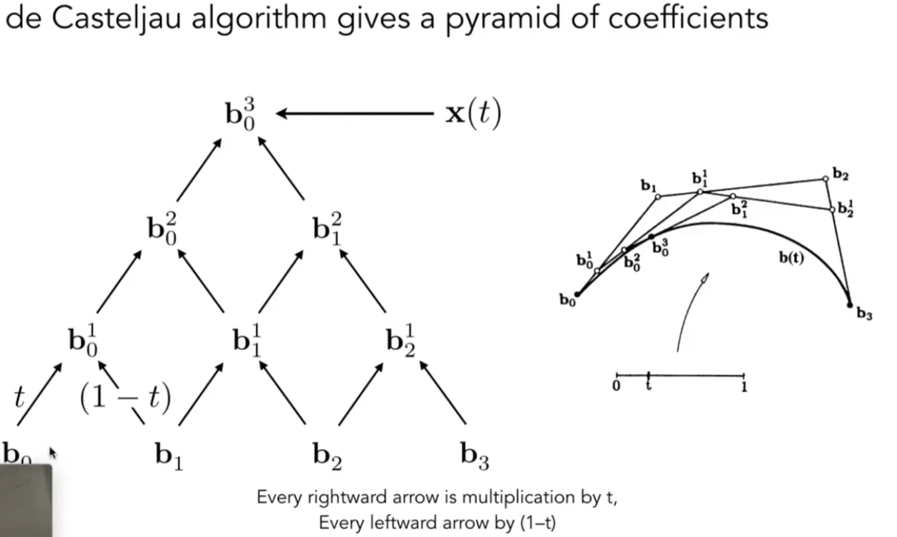

# 隐式几何
隐式几何通过一个或多个函数来**描述**一个几何形状所满足的性质，而不是直接给出它的顶点坐标
**核心思想**: 一个点 P(x,y,z) 是否属于某个几何体，取决于它代入函数 f(x,y,z) 后的结果。
- f(P)=0: 点在物体表面上
- f(P)>0: 点在物体外部
- f(P)<0: 点在物体内部
**优点**: 判断一个点与物体的内外关系非常方便；可以轻松表示复杂的拓扑结构
**缺点**: 直接绘制或遍历物体表面上的所有点比较困难、

下面展示一些常见的隐式表达
## 基本函数
使用单个式子约束

## 简单几何的表达式组合
通过对简单的几何体进行布尔运算（并、交、差）来组合成复杂的形状

## 距离函数
函数 $f(P)$ 的值代表了点 P 到物体表面的最短距离。这在模拟物体融合、变形等效果时非常有用

例子：求物体运动的中间状态，通过加入距离函数来将线性插值的灰区域进一步细分得到从黑到白的渐变

## 分形
通过简单的规则进行无限次迭代，生成具有自相似性的复杂几何体
 
# 显式几何
显式几何直接**列举**出构成几何形状的所有元素，最常见的就是参数化地表示顶点、边和面
**核心思想**: 直接给出所有顶点的坐标，并定义它们之间的连接关系
**优点**: 绘制图形非常方便（特别是对于现代 GPU 的光栅化管线）
**缺点**: 判断一个点在物体内部还是外部比较困难
## 点云
用（X, Y, Z）列表来储存。可以表示任何几何，原始数据一般用这个，不过**无序**

## 多边形网格
点云的扩展，包含更多信息，如边、法线等
网格通过连接点来形成表面，这对于渲染来说至关重要

### obj 文件
obj文件格式是多边形网格的典型例子，其主要内容如下：

- 顶点：v（顶点 xyz 坐标）
- 纹理坐标（用于映射）：vt（纹理坐标）
- 法线：vn（法线方向）
- 面：f（顶点 1 坐标/顶点纹理坐标/顶点法线方向顶点 2…    顶点3…）
注意：
面的定义使用顶点、纹理坐标和法线的索引，而不是直接使用坐标。
这些索引是 1-based 的，即第一个顶点的索引是 1 而不是 0。
不是所有的面都需要指定纹理坐标
顶点在面中的顺序影响表面的定向，由于绕向顺序影响光照计算

## 贝塞尔曲线

实际上是关于 t 的参数方程, 可以总结为伯恩斯坦多项式的加权组合形式：

性质：
- n 阶贝塞尔曲线有 n+1 个点
- 起点和终点由首尾两个控制点决定，如：$b(0)=b_{0},b(1)=b_{n}$
- 对于 n 阶贝塞尔曲线，首/尾点的切线是前两个控制点/后两个控制点的 n 倍矢量, 如：$b'(1)=n(b_{n}-b_{n-1})$
- 控制点的仿射变换即曲线的仿射变换
- 凸包性质，贝塞尔曲线必在控制点的凸包内

### 分段贝塞尔曲线
高阶贝塞尔曲线的递归求解比较麻烦，所以一般采用分段定义，每段一般由 4 个控制点组成（3 阶贝塞尔曲线）

段连接位置要保证光滑，只需要保证连接点处的切线矢量相等 （方向+长度）即可，如在 ps 等软件中出现了操纵杆的概念（操纵杆的长度左右相同）
**黑点为每段的首尾点，而蓝点（即操纵杆上的点）根据顺序和黑点一同组成了贝塞尔曲线的四个点**
### 贝塞尔曲面

使用四条贝塞尔曲线在某个 t 的点作为新贝塞尔曲线的四个控制点

# 几何处理
对三角形网格mesh的操作
## 网格细分mesh subdivision(upsample)
**目标**: 通过增加三角形（或多边形）的数量来表示物体表面，使得细分后的表面更加平滑。需要注意的是，这提高了表面的**平滑度**，但不改变其原始的**精确度**
**通用步骤**:
1. **拓扑变更**: 增加新的顶点和面，将原有的网格拆分得更细。
2. **几何更新**: 调整新、旧顶点的位置，使整体表面趋于光滑。
下面介绍两种细分的算法

### Loop 细分
**适用对象**: 只能用于**纯三角形**网格
- 1.选取原来的三角形的三条边的**中点**作为新的三角形顶点,并以此将每个三角形划分成四个小三角形
- 2.根据权重改变三角形顶点的位置，使用不同的方法来**移动新的顶点和旧的顶点**
	- 将新顶点的位置调整为**周围的旧顶点加权平均**
	- 将旧顶点与该顶点**周围的旧顶点以及该顶点自身**进行加权平均，具体细节是根据该点的度数来决定权重的（度数越少的这个点自身越重要）
### Catmull-Clark 细分
**适用对象**: 可用于包含任意多边形（如四边形、五边形等）的通用网格

假设表面上有四边形面（quad face）和非四边形面（Non-quad face），表面上度数不为4的顶点都是**奇异点**

步骤：
- 1.引入更多的点
	- 添加**所有边的中点与所有面的中心点**(重心或其他点)，然后将边上的都与面上选取的中心点连接起来。这样操作后，**所有非四边形面都消失了**，并且在原先非四边形面上选取的中心点在操作后**变为奇异点**(在第一次细分之后会增加奇异点数，但是在之后的细分时不会增加奇异点数量，因为在第一次细分后表面上就没有非四边形面了)
- 2.更新点的位置。此时面上一共有三种点，需要使用不同的更新规则
	- 【1】面的中心点：其面上的旧顶点的算数平均
	- 【2】边的中点：其边上的顶点与相接的两个面的中心点算数平均
	- 【3】旧顶点：周围面的中心点，相交边的中心点与旧顶点本身进行加权平均

## 网格简化mesh simplification (downsampling)
**目标**: 网格细分的逆过程。在尽可能保持物体原始形状和视觉效果的前提下，使用更少的三角形来表示模型，以减少计算和存储开销

应用场景：当物体模型距离视点距离很远时，减少面的数量不会影响视觉效果。(可以根据物体模型和视点的距离来选用不同具有不同数量的面的模型,越近使用更多的面，这是**几何的层次结构**，较难处理，而前面提到的纹理图像的层次结构很容易处理，例如使用Mipmap)

简化方法：边坍缩算法(Edge Collapsing Algorithm)
### 边坍缩算法
边坍缩是实现网格简化的主流算法，使用**二次度量误差**决定“应该坍缩哪条边”以及“坍缩到哪里”
#### 二次度量误差：
通过数学上的二次误差函数（Quadric Error Function），高效地衡量网格简化过程中顶点合并导致的几何信息损失，从而指导最优的简化策略
计算步骤：
- 1.对每个三角形平面生成误差矩阵。每个三角形平面的方程可化为 $ax+by+cz+d=0$，其对应的二次误差矩阵 $K$ $$
K=\left[\begin{matrix}
a^2&ab&ac&ad \\
ab&b^2&bc&bd \\
ac&bc&c^2&cd \\
ad&bd&cd&d^2
\end{matrix}\right]
$$
- 2.为每个顶点分配误差矩阵，顶点 $v$ 的误差矩阵 $Q_v$ 是**所有相邻三角形平面**的误差矩阵之和$$
Q_{v}=\sum^n_{i=1}K_{i}
$$ 其中 $n$ 是顶点 $v$ 的邻接三角形数量
- 3.计算收缩边的代价
	- 输入：一条边 $e=(v_{1},v_{2})$
	- 步骤：
		- [1]合并误差矩阵 $Q_{new}=Q_{v_{1}}+Q_{v_{2}}$
		- [2]求解最优合并位置 $v'$：通过最小化误差函数 $Erroe(v')=(v')^TQ_{new}v'$ 求得位置 $v'$。若方程组无解，直接使用 $v_{1},v_{2}$ 或者中点
		- [3]计算合并代价：将 $v'$ 代入误差函数 $Error(v')$，得到合并代价

#### 坍缩具体过程 ：
1. 计算当前模型中**所有边**的二次度量误差：对于每一条边，我们假设对每条边进行坍缩（具体方法需要自己决定），确定该边的最小二次度量误差与对应坍缩后的点的位置
2. 先择**最二次误差最小的边**进行坍缩，这时和这条边两个顶点相邻的边的最小二次误差回变化，需要**更新这些边的最小二次误差**（维护一个优先队列）
3. **重复**步骤 2，直到迭代到满足终止的条件
## 网格正则化mesh regularization
**目标**: 优化网格的质量，避免出现“狭长”或“尖锐”的三角形。这类三角形在渲染、物理模拟和纹理映射中都可能导致问题。正则化的目标是在不严重改变模型形状的前提下，让三角形更接近等边三角形，且大小分布更均匀
### 边翻转
检查共享一条边的两个相邻三角形。如果翻转这条共享边（连接另外两个顶点）可以改善这两个三角形的质量（例如，增加它们的最小角），则执行翻转
