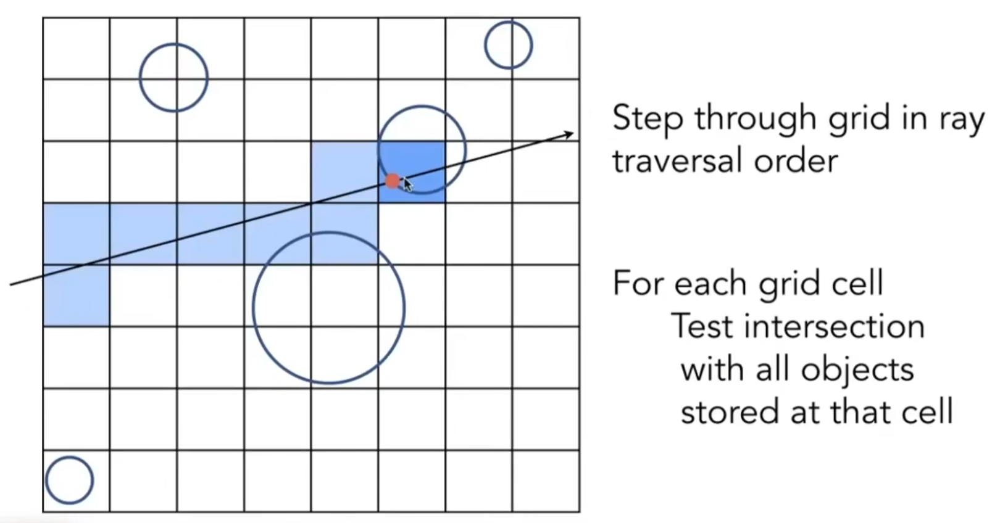

# 阴影贴图Shadow Mapping
光栅化本质上是一个将三维几何体“拍扁”到二维屏幕的过程，它本身并不理解光线、遮挡和反射等物理现象。因此，为了实现像阴影这样基础的效果，我们需要引入**阴影贴图 (Shadow Mapping)**，这是生成实时阴影的核心技术

核心思想：**如果一个点从光源的视角看不见，那么它一定位于阴影之中**

## 算法步骤

### 1. 光照渲染阶段
- **从光源视角渲染**: 将摄像机（虚拟的）放置在**光源**的位置，并**朝向光源照射的方向**
- **生成深度图**: 渲染整个场景。在这个阶段，我们不关心颜色、纹理等信息，只关心每个片元的**深度值**（即该点到光源的距离）
- **存储深度图**: 将这些深度值存入一张特殊的纹理中，这张纹理就是**阴影贴图 (Shadow Map)**。阴影贴图中的每个像素存储了从光源视角看过去，在该方向上离光源**最近的物体的深度**

## 2.相机渲染阶段 (Camera Pass)
1. **从主相机视角渲染**: 像往常一样，从主相机的视角渲染场景。
2. **坐标变换**: 对于场景中的每一个需要被着色的片元，执行以下操作：
    - 将其世界坐标变换到光源的裁剪空间（与阶段一中生成阴影贴图时使用的空间相同）。这样我们就得到了该片元在光源视角下的坐标 `(x_light, y_light, z_light)`
3. **深度比较**:
    - 使用 `(x_light, y_light)` 作为纹理坐标，去查询**阴影贴图**中对应位置存储的深度值 `z_shadowmap`。这个值代表了光源能直接照到的最近表面的深度
    - 比较当前片元在光源视角下的深度 `z_light` 和从阴影贴图中读取的深度 `z_shadowmap`
4. **判断阴影**:
    - 如果 `z_light > z_shadowmap`，说明当前片元比光源能直接照射到的物体更远，因此它被那个物体遮挡了，**处于阴影中**
    - 如果 `z_light <= z_shadowmap`，说明当前片元就是离光源最近的物体，**它被光照亮**
    - 需要特别注意**浮点精度问题**

## 软阴影和硬阴影

- **硬阴影 (Hard Shadows)**: 阴影的边缘清晰锐利。标准的 Shadow Mapping 算法产生的就是硬阴影，因为深度比较是一个二元测试（要么在阴影里，要么不在）。这模拟的是**点光源**的效果
- **软阴影 (Soft Shadows)**: 阴影的边缘有模糊的过渡区域（半影）。这更符合现实，因为现实世界的光源（如太阳、灯泡）都有一定的**面积**，而不是无限小的点

根据这张图，软阴影产生的最根本原因是光源（太阳）不是一个无限小的**点光源**，而是一个具有体积和面积的**面光源 (Area Light Source)** 
### 软阴影的构成：本影与半影
正是因为光源有面积，阴影才会被划分为两个区域：本影 (Umbra) 和半影 (Penumbra) 。
- **本影 (Umbra)**
    - **定义**: 阴影最暗的核心区域。
    - **成因**: 在这张图中，地球上位于本影区域的任何一点，其望向太阳的视线都**完全**被月球遮挡了。因此，这个区域接收不到任何来自太阳的直射光，是完全黑暗的。
- **半影 (Penumbra)**
    - **定义**: 位于本影周围的、明暗发生渐变的过渡区域 
    - **成因**: 在地球上位于半影区域的任何一点，其望向太阳的视线**部分**被月球遮挡。这意味着观察者能看到一部分的太阳，但看不到完整的太阳 
### “软”的本质
软阴影的“软”，指的就是从“完全被照亮”到“完全黑暗”之间存在一个平滑的过渡地带，这个地带就是**半影**
- **亮度变化**: 在半影区域中，越靠近本影，能看到的太阳面积就越小，因此该点接收到的光照就越弱，阴影就越暗。反之，越靠近全亮的区域，能看到的太阳面积就越大，光照就越强，阴影就越亮 
- **视觉效果**: 这种亮度的逐渐变化，在视觉上就形成了我们所说的**模糊、柔和的阴影边缘**

## 局限性
经典的 ShadowMapping 技术只能处理点光源，拓展后可以处理多点光源，但是仍有一些无法被完全避免的局限性
- **锯齿 (Aliasing)**: 由于阴影贴图的分辨率是有限的，阴影的边缘会呈现出块状或锯齿状
- **阴影粉刺 (Shadow Acne)**: 由于**浮点数的精度问题**，一个表面上的点在进行深度比较时，可能会错误地判断自己处于自己投下的阴影中，导致表面出现不规则的深色条纹
- **彼得潘现象 (Peter Panning)**: 为了解决阴影粉刺，我们通常会给深度值加上一个小的偏移量 (Bias)，但如果这个偏移量太大，就会导致阴影与物体本身“分离”，看起来像是物体“飞”了起来，如同彼得潘一样
- **透视走样 (Perspective Aliasing)**: 从摄像机视角看，近处的物体需要高分辨率的阴影，远处的物体则不需要。但标准的 Shadow Map **分辨率是均匀**的，这会导致近处的阴影分辨率不足（出现锯齿），而远处的阴伤了分辨率

阴影贴图的种种局限性，根源在于它是一种基于图像空间的近似方法，而非对物理世界的真实模拟。为了从根本上解决这些问题，并优雅地实现软阴影、反射、折射等更复杂的光学现象，图形学界转向了一种更符合物理直觉的渲染范式——**光线追踪**
# 光线追踪
光线追踪不再问“一个三角形覆盖了哪些像素？”，而是反过来问“一个像素看到了什么？”。它通过模拟光线的物理传播路径来生成图像
## 光线追踪与光栅化
为了理解光线追踪，我们可以将它与我们已经熟悉的光栅化渲染管线进行对比
- **光栅化 (Rasterization)**
    - **核心思想 (正向)**: “对于场景中的**每一个三角形**，它最终会**覆盖屏幕上的哪些像素**？”
- **光线追踪 (Ray Tracing)**
    - **核心思想 (逆向)**: “对于屏幕上的**每一个像素**，我们通过它能看到什么？”
    - **经典（Whitted-Style）光线追踪流程**
    1. **主光线 (Primary Ray)**: 从摄像机位置，穿过屏幕上的每一个像素，向场景中发射一条主光线
    2. **求交测试**: 计算这条光线与场景中所有物体的交点，找到最近的那个交点
    3. **着色计算**: 在交点处，计算该点的颜色。
	   - **阴影光线 (Shadow Ray)**: 从该交点向**每一个光源**发射一条阴影光线。如果阴影光线在到达光源前碰到了任何其他物体，则该点处于阴影之中；否则，它被该光源照亮
	   - **反射/折射光线**: 如果交点所在的表面是反射或折射材质，则根据物理定律（如菲涅尔方程）生成新的反射或折射光线，并**递归地重复步骤 2 和 3**，将其结果贡献给当前点的颜色
    - **优点**:
        - **物理精确**: 这种判断阴影的方式完全符合物理直觉，能自然而然地生成**像素级别精确**的硬阴影，从根本上避免了 Shadow Mapping 的所有分辨率和精度问题
        - **优雅地实现软阴影**: 我们不再是从交点向光源发射一条阴影光线，而是发射**多条**，分别**射向面光源上的不同位置**。最终的阴影强度由“未被遮挡的光线条数所占的百分比”决定，完美地模拟出了本影和半影的过渡
        - **实现全局效果**: 除了阴影，**光线在击中物体后还可以继续反弹**（反射光线）或折射（折射光线），从而用统一而优雅的框架实现反射和透明效果
    - **缺点**: 计算量极其巨大。因为每个像素都可能需要发射多条光线，并进行大量的光线-物体求交测试。
## 光线追踪的算法实现
要实现光线追踪，我们需要解决两个核心问题：
- 如何用数学方式表示一条光线
- 如何计算这条光线与场景中物体的交点
### 光线的表示

一条光线可以被定义为一个**起点**和一个**方向**。在数学上，我们可以用一个参数方程来表示
$$
r(t)=o+t\vec{d}
$$
- $o$ 光线的起点
- $\vec{d}$ 光线的方向向量，通常是单位向量
- $t$ 是一个控制参数
### 光线与物体表面的求交
计算光线与物体的交点，本质上就是解一个方程组：**将光线的参数方程代入物体表面的隐式几何方程中**求解 t
#### 光线与球面的交点
##### 球面的隐式表示
一个以点 $c$ 为球心，半径为 $R$ 的球面，其表面上任意一点 $p$ 都满足：
$$
(p-c)^2-R^2=0
$$
##### 解方程求交点
将光线方程 $r(t)=o+t\vec{d}$ 代入球面方程中的 $p$ （都是点）
$$
(o+t\vec{d}-c)^2-R^2=0
$$
这可以变换为一个关于参数 $t$ 的一元二次方程 $At^2+Bt+C=0$
判断交点可以通过求解这个二次方程的判别式 $\Delta=B^2-4AC$
- $\Delta<0$：光线与球面没有交点
- $\Delta=0$ ：光线与球面相切，有一个交点
- $\Delta>0$：光线穿过球面，有两个交点。我们需要找到两个解中较小的那个正数 $t$，它代表了离光线起点最近的那个交点

#### 光线与隐式表达的交点

#### 光线与三角形（显式平面）的交点
由于任何一个三角形都可以看成位于一个无限大的平面上，所以我们可以将光线与三角形的交点分为两步：
- 计算光线与该三角形所在平面的交点
- 判断这个交点是否在三角形内部

##### 平面的隐式表示
一个平面可以通过其**法线向量**$\vec{N}$ 和平面上任意一点 $p_{0}$ ​ 来定义,该平面上任意一点 $p$ 都满足：
$$
(P-P_{0})\cdot \vec{N}=0
$$
##### 解方程求交点
将光线方程 $r(t)=o+t\vec{d}$ 代入平面方程中的 $p$ （都是点）
$$
(o+ t\vec{d}-p_{0})\cdot \vec{N}=0
$$
解得
$$
t=\frac{(p_{0}-o)\cdot \vec{N}}{d\cdot \vec{N}}
$$
如果分母 $d\cdot \vec{N}=0$ 说明光线与平面平行，没有交点（或光线在平面内）

最后我们将这个点和对应的三角形判断一下是否在其内部，就可以知道这个三角形**是否被这一根光线照亮了，但是这样的判定效率太低，我们可以使用MT算法来直接判断是否在三角形内部而不是作为两步来做**

##### MT 算法优化

我们使用重心坐标描述三角形，即三角形上的点的位置矢量一定可以表示成：
$$
(1-b_{1}-b_{2})\vec{P_{0}}+b_{1}\vec{P_{1}}+b_{2}\vec{P_{2}}
$$
其中 $\vec{P_{0}},\vec{P_{1}},\vec{P_{2}}$ 是三角形三个点的位置矢量

当光线与三角形有交点时，一定有方程：
$$
\vec{O}+t\vec{D}=(1-b_{1}-b_{2})\vec{P_{0}}+b_{1}\vec{P_{1}}+b_{2}\vec{P_{2}}
$$
可以解出线性方程组中未知量 $t,b_{1},b_{2}$，如果 $b_{1},b_{2},1-b_{1}-b_{2}$ **非负**，且 $t>0$，则可以确定这个点是否在三角形的里面，求解公式如上      

##### 效率分析
算法的效率不仅取决于最终结果，更取决于获得该结果所需的**浮点运算次数**、**运算类型**（除法和开方通常比乘法和加法慢得多），以及算法结构是否支持**提前终止**
###### 两步法
- 计算平面法线 $\vec{N}$: 需要 1 次向量叉乘 $(P_{1}-P_{0})\times(P_{2}-P_{0})$
- 每条光线计算 $t$ 值，需要一次减法，两次点乘，一次加法
- 使用重心坐标法判断需要**额外进行数次向量减法和点积/叉乘**来计算重心坐标并判断其范围

此方法的主要缺陷在于其**串行和固定的高开销**。无论光线最终是否与三角形相交，它几乎总需要执行到第三步才能知道交点 `P` 的位置，而最昂贵的内部判断测试则留在了最后。对于绝大多数未击中三角形的光线，前面的法线计算、点积和**除法**运算都被浪费了

##### MT 算法
- **计算边向量**: $E_{1}=P_{1}-P_{0},E_{2}=P_{2}-P_{0}$
- **计算行列式 (Determinant)**: 涉及 1 次叉乘和 1 次点积。这个行列式的值可以立即用来进行第一次**提前终止**测试：如果行列式接近于零，说明光线与三角形平面平行，直接返回“未命中”
- **进行一次除法**: 计算 `1 / determinant`。这是整个算法中**唯一的一次除法**。
- **计算第一个重心坐标 `b₁`**: 涉及 1 次叉乘、1 次点积和 1 次数乘。计算后立即进行范围检查 `(b₁ < 0 or b₁ > 1)`，这是第二次**提前终止**的机会
- **计算第二个重心坐标 `b₂`**: 涉及 1 次叉乘、1 次点积和 1 次数乘。计算后立即进行范围检查 `(b₂ < 0 or b₁+b₂ > 1)`，这是第三次**提前终止**的机会
- **计算 `t` 值**: 在确认交点位于三角形内部后，最后才计算 `t` 值（涉及 1 次叉乘、1 次点积和 1 次数乘）并检查 `t>0`
MT 算法在数值计算上远胜于两步法：
- **统一计算**: 它将所有必要的测试都整合在一个流程中，避免了冗余计算
- **延迟除法 (Deferred Division)**: 它将昂贵的除法运算推迟到几乎最后，并且整个过程只执行一次
- **多次早退机会 (Multiple Early Exits)**: 算法的结构被精心设计，可以在多个检查点提前终止计算。考虑到在任何场景中，绝大多数光线都不会击中某个特定的三角形，这种为“未命中”情况优化的结构极大地提升了平均性能

## 加速结构
我们已经知道了如何判断**一条**光线与**一个**物体的相交。但在真实场景中，屏幕有数百万像素，每个像素可能发射多条光线，而场景中又有数百万个三角形。对每条光线都遍历测试所有三角形是完全不可行的，其计算复杂度是天文数字。为了让光线追踪变得可行，我们需要**加速结构**
### Bounding Volumes

可以借助光栅化中的 bbox 的思想，不直接测试复杂的物体（如一个精细的模型），而是先测试一个能完全包裹住该物体的简单几何体（如球体或长方体），这被称为**包围体**。这样就能避免过早的扣细枝末节，使得光线与包-围体的求交计算加快
- 如果光线没有击中包围体，那么它一定不会击中内部的复杂物体，我们可以直接跳过所有后续测试
- 只有当光线击中了包围体，我们才需要对其内部的物体进行精确的求交测试

#### AABB 包围盒
使用长方体作为包围盒时，我们可以将一个立方体分为三对平行平面

在二维场景中，以 $(xoy)$ 为例子，从光源分别计算到 $x_{0}x_{1},y_{0}y_{1}$ 这两对平行平面的进入和移出的时间，而后求着；两个时间的交集，就得到光源实际进入和移出盒子的时间

将其扩展到三维场景，只有当光线进入到所有三对对面时，才算进入盒子。光线离开任意一对对面，就算离开。
- 对于每对对面，各自计算最大和最小进入时间。
- 求所有三组进入时间的最大值为 $t_{\text{进入}}$，离开时间的最小值 $t_{\text{离开}}$
- 当 $t_{\text{进入}}<t_{\text{离开}}$ 时，说明光线可以进入包围盒
处理特殊情况
- $t_{\text{离开}}<0$：盒子在光线背后
- $t_{\text{进入}}<0\text{且}t_{\text{离开}}\geq_{0}$：光线起点在盒子里

如何将模型快速的划分出包围体，就需要使用快速划分算法
#### 快速划分算法
快速划分算法（或称空间划分）的目标就是将空间或物体组织成一种层级结构（通常是树），使得光线遍历时可以快速排除掉大量不相关的物体

##### 八叉树Oct-Tree
一种严格的**空间划分 (Space Partitioning)** 方法。它将一个立方体空间递归地、均匀地划分为八个大小相等的子立方体（从二维看就是四个子正方形）
**构建过程**:
1. 创建一个能包裹整个场景的根节点（立方体）。
2. 如果一个节点中的**物体数量超过了某个阈值**，并且**尚未达到最大深度**，就将其均匀地划分为八个子节点。
3. 将父节点中的物体分配到能完全包含它们的**最小**子节点中。如果一个物体**跨越了多个子节点，它通常被存储在它们的父节点中**
**光线遍历**: 从根节点开始，计算光线会依次穿过哪些子节点。递归地进入这些被穿过的子节点，直到到达叶子节点，然后与叶子节点中的物体进行求交测试
**优缺点**:
- **优点**: 结构简单，易于理解和实现。对于物体分布比较均匀的场景（如体素数据），效果很好
- **缺点**: **适应性差**。对于物体分布极不均匀的场景，会导致大量不必要的空间划分和空的树节点，浪费内存且降低效率
##### KD-Tree
一种更具适应性的**空间划分**方法。它不像八叉树那样均匀切分，而是每次选择一个轴（K维空间中的一维），用一个与该轴垂直的平面将当前空间一分为二

**构建过程**:
1. 从根节点开始，选择一个划分轴（如X轴）。
2. 选择一个划分位置（例如，物体坐标的中位数），用一个平面（如 x=c）将空间分为“左”和“右”两个子空间（**一般在正中间划分**，但高级的构建，会为了让树更平衡，选择**物体坐标的中位数 (median)** 作为划分位置）
3. **递归地对左右子空间进行划分**，下一次划分**通常会选择下一个轴**（Y轴，然后Z轴，循环往复），如果一个空间区域内包含的物体数量**少于或等于预定阈值**，就停止划分，让这个区域成为一个叶子节点。
4. 物体被分配到其所在的子空间。如果一个物体跨越了划分平面，可能需要将其**同时**分配给两个子节点，或者进行切割

**光线遍历**: 从根节点开始，判断光线**从划分平面的哪一侧进入**，优先遍历那一侧的子树。然后，根据当前已找到的最近交点，判断是否有必要进入平面的另一侧子树进行查找
**优缺点**:
- **优点**: 比八叉树更能适应不均匀的几何分布，划分更智能，能产生更“紧凑”的节点
- **缺点**: 构建过程较慢。物体跨越划分平面时处理起来很麻烦（可能导致物体引用被复制）。对于动态场景的更新非常困难，几乎需要完全重建
##### BSP-Tree
最通用的**空间划分**方法。它不像KD-Tree那样只能使用与轴对齐的平面，而是可以使用**任意方向**的平面进行二分
**构建过程**:
1. 在场景中选择一个多边形，用它所在的平面作为划分平面。
2. 场景中其他的多边形根据它们与该平面的关系，被分为“前”、“后”或“跨越”三类。
3. 跨越平面的多边形必须被**切割**成两部分。
4. 递归地对前、后两个子空间进行构建。
**光线遍历**: 与KD-Tree类似，判断光线起点在哪一侧，优先遍历该侧子树。BSP树的一个独特优势是能提供一个严格的由近及远或由远及近的物体排序
- **优缺点**:
    - **优点**: 能够非常紧密地贴合几何体，潜在的剔除效率非常高
    - **缺点**: **构建极其昂贵**，因为需要进行大量的多边形切割，导致场景中的多边形数量急剧增加。**完全不适用于动态场景**。它在早期的游戏（如Doom）中用于可见性判断，但在现代光线追踪中已很少使用
##### Bounding Volume Hierarchy (BVH)
与上述三者都不同，BVH是一种**物体划分 (Object Partitioning)** 方法。它不划分空间，而是将**物体的集合**递归地划分为两个子集，并为每个子集计算一个更紧密的包围盒（有点类似密度聚类的思想）

**构建过程**:  
1. 为场景中所有的物体创建一个根节点包围盒
2. 选择一个划分轴（通常是当前节点包围盒最长的轴）
3. 将节点内的物体沿该轴排序，**并分成两组**（例如，按物体中心点坐标中位数划分）
4. 为这两组物体分别创建子节点，并计算它们各自的紧密包围盒
5. 递归地对子节点进行划分，直到叶子节点只包含少量物体

**优化**: 使用**SAH (Surface Area Heuristic)** 算法来决定最佳的划分轴和位置，其目标是让划分后的子节点包围盒表面积之和尽可能小，从而最大化光线剪枝的概率

**光线遍历**:
1. 从根节点开始，测试光线是否与左右子节点的包围盒相交
2. 如果只与一个相交，则递归进入该子节点
3. 如果与两个都相交，通常会**优先进入光线先到达的那个包围盒**
4. 如果都不相交，则返回
5. 最终在叶子节点与物体进行求交测试

**优缺点**:
- **优点**:
    - **构建速度相对快**，且可以被高度优化。
    - **完美适应动态场景**：当物体移动时，**只需更新受影响节点的包围盒**（Refitting），成本很低；即使需要重建，速度也远快于KD-Tree或BSP-Tree
    - **内存效率高**: 不切割物体，不复制物体引用。
    - **遍历性能**: 包围盒可以紧密贴合物体，尤其是使用SAH构建时，剪枝效率极高
- **缺点**: 子节点的包围盒可能会相互重叠，这在理论上会比不重叠的KD-Tree多一些模棱两可的遍历判断，但实践中其优势远大于此缺点
##### 比较

| 特性 (Feature) | Oct-Tree       | KD-Tree       | BSP-Tree            | Bounding Volume Hierarchy (BVH) |
| ------------ | -------------- | ------------- | ------------------- | ------------------------------- |
| **划分方法**     | **空间划分**       | **空间划分**      | **空间划分**            | **物体划分**                        |
| **划分策略**     | 均匀立方体划分        | 轴对齐平面，自适应位置   | 任意方向平面              | 根据物体集合分裂                        |
| **与几何体的贴合度** | 差              | 中等            | 极好 (但代价高昂)          | **非常好** (包围盒紧贴物体)               |
| **构建速度**     | 快              | 慢             | **极慢**              | **快** / 中等 (SAH)                |
| **遍历效率**     | 中等，依赖场景        | 很好 (静态场景)     | 很好                  | **极好**                          |
| **内存占用**     | 高，尤其在非均匀场景     | 中等 (跨平面物体会增加) | **极高** (切割后几何体数量激增) | **低**                           |
| **处理动态场景**   | 困难             | 非常困难          | **几乎不可能**           | **优秀** (支持快速Refitting和重建)       |
| **现代应用**     | 较少用于光追，多用于体积像素 | 用于一些静态场景的离线渲染 | 几乎不再用于光追，用于可见性判断    | **行业标准** (实时光追、电影渲染)            |

### 辐射度量学Radiometry
辐射度量学提供了一套物理单位和概念，用于精确测量和描述电磁辐射（包括可见光）的传播。**它是实现基于物理的渲染** (Physically Based Rendering, PBR)的理论基石，让我们能够从“看起来差不多”的经验模型，转向“物理上正确”的模拟
#### 物理概念定义

##### 辐射能量 (Radiant Energy, Q)
- **严谨定义**: 电磁辐射的能量总和，是电磁波中光子能量的总和。
- **单位**: 焦耳 (Joules, J)
- **直观理解**: 想象一个手电筒，把它开灯一段时间后关掉。在这段时间内，它发射出的**所有光子的总能量**就是辐射能量。它是一个累计量
- 我们通常更关心能量的流动速率，而不是总量
##### 辐射通量 (Radiant Flux, Φ)
- **严谨定义**: 单位时间内通过某个面或空间区域的辐射能量。它是辐射能量对时间的导数$$Φ=\frac{dQ}{dt}​$$
- **单位**: 瓦特 (Watts, W)，即 焦耳/秒 (J/s)
- **直观理解**: 这就是我们常说的光源的“功率”。一个100瓦的灯泡，其辐射通量就是100W，意味着它每秒向**周围**发射100焦耳的能量。它描述的是能量的**速率**
##### 辐射强度 (Radiant Intensity, I)

- **严谨定义**: 从一个点光源出发，在**单位立体角 (Solid Angle)** 内传播的辐射通量。它是辐射通量对立体角的导数$$
I(\omega)=\frac{d\Phi}{d\omega}
$$
- **单位**: 瓦特/立体弧度 (Watts/steradian, W/sr)
- **直观理解**: 它描述了一个点光源向**特定方向**发射光线的“威力”有多大。一个各向同性的点光源（像一颗恒星）向所有方向的辐射强度都相同。而一个手电筒或聚光灯，其正前方的辐射强度就非常高，而侧方的辐射强度则很低
- **图形学中的作用**: **定义了点光源和聚光灯**,我们不再需要用模糊的参数来描述一个聚光灯，而是可以直接用辐射强度的**分布函数**来精确定义它在每个方向上的亮度

###### 立体角

二维平面中的角在三维空间中的扩展

**二维角 (Angle, theta)**:
- **定义**: 在一个圆中，一段**圆弧的长度 l** 与其**半径 r** 之比
- **公式**: $\theta=\frac{l}{r}$
- **单位**: **弧度 (radian)**。整个圆的角是 $2\pi$ 弧度

现在，我们将这个概念扩展到三维：
**三维立体角 (Solid Angle, omega)**:
- **定义**: 在一个球体中，一块**球面上的面积** $A$ 与其**半径平方** $r^2$ 之比
- **公式**: $\omega=\frac{A}{r^2}$
- **单位**: **立体弧度** (steradian, **sr**)
- **直观理解**: 衡量一个从球心发出的**圆锥**的“锥度”或“立体张开程度”。它描述了从一个观察点看过去，一个物体在视野中占据的“大小”
**关键点**: 正如二维角的大小与圆的半径无关一样，**立体角的大小也与球体的半径无关**。它是一个纯粹的“角度”度量

**微分立体角 (domega)**

在渲染方程等积分计算中，我们需要对极小的立体角进行操作，这就是**微分立体角 domega**

在球坐标系中，一个方向可以用天顶角 $\theta$ (polar angle) 和方位角 $\phi$ (azimuthal angle) 来表示。一个极小的立体角 $d\omega$ 可以用这两个角的变化来表示：
$$
d\omega=\sin \theta d\theta dϕ
$$
这个公式是求解渲染方程数值积分的基础

对于整个球来说则有

由此也可算出点均匀光源的辐射强度公式

##### 辐照度 (Irradiance, E）

- **严谨定义**: 入射到物体表面上**单位面积**的辐射通量。它是辐射通量对面积的导数$$
E(x)=\frac{d\Phi}{dA}
$$
- **单位**: 瓦特/平方米 (Watts/m²)
- 注意这里的面积是有效面积
**使用辐照度解释能量损失**

越往外传播面积越大，所以单位面积上的辐射通量越小
##### 辐射亮度 (Radiance, L)
这是辐射度量学中**最重要、最核心**的概念

- **严谨定义**: 在特定方向上，通过单位**投影面积**、单位**立体角**的辐射通量$$
L(x,\omega)=\frac{d^2\Phi}{d\omega dA\cos \theta}
$$ 其中 $dA\cos \theta$ 是 $dA$ 在垂直于光线方向 $w$ 上的投影面积
- **单位**: 瓦特/(立体弧度 · 平方米) $(W/(sr·m^2))$
- **直观理解**: 它描述了从**某个方向**看去，一个**面上的某个点**“看起来”有多亮。它同时包含了方向和位置信息，是我们人眼或摄像机最终感知到的物理量
    - **类比**: 想象你看向路灯下的一小块被照亮的地面。这块地面在你眼中有多亮，就对应着辐射亮度。它不仅取决于地面有多亮（辐照度），还取决于你看向它的角度
- **图形学中的作用**: **辐射亮度是光线追踪算法的灵魂**
    1. **对应光线**: 一条光线 (Ray) 所携带的能量，在物理上就是用辐射亮度来描述的。
    2. **沿途不变**: 辐射亮度有一个极为重要的特性：在真空中沿直线传播时，其值**不会改变**。这意味着从A点表面射向B点的辐射亮度，就是B点接收到的来自A点的辐射亮度。这大大简化了渲染计算
    3. **最终像素值**: 渲染出的图像中，每个像素的颜色值，最终就是**从那个像素方向入射到**虚拟摄像机上的**辐射亮度**的值
    4. **渲染方程的核心**: 渲染方程本身就是一个关于辐射亮度的积分方程

##### 辐照度与辐射亮度之间的关系

### BRDF
**双向反射分布函数: Bidirectional Reflectance Distribution Function**
当光照射到一个物体表面时，会发生什么？
- 有些光会被吸收（变成热能）
- 有些光会进入物体内部（次表面散射，Subsurface Scattering）
- 剩下的光会被**反射**
BRDF 就是一个用来精确描述光线如何被**反射**的函数（有点类似于分布函数）

BRDF 回答的核心问题非常直观：**“对于从任意一个方向 $\omega_i$ 射入的光线，有多少能量会被反射到任意一个出射方向 $\omega_o$ 上去？”**
它是一个描述材质反射特性的函数，其输入是**入射光方向** $omega_i$ 和**出射光方向（观察方向）** $\omega_o$，输出是这两个方向之间光能传递的比例
#### 严谨定义

$BRDF (f_r)$ 的数学定义是：反射光的辐射亮度 (Radiance) 与入射辐照度 (Irradiance) 之比
$$f_r​(\omega_i​→\omega_o​)=\frac{dL_{o}(\omega_{o})}{dE_{i}(\omega_{i})}=\frac{dL_{o}(\omega_{o})}{L_{i}(\omega_{i})\cos \theta_{i}d\omega_{i}}$$
- $dL_o(\omega_o)$: 从 $\omega_o$ 方向出射的微分辐射亮度
- $dE_i(\omega_i)$: 从 $\omega_i$ 方向入射的微分辐照度
- $L_i(\omega_i)$: 从 $\omega_i$方向入射的辐射亮度
- $\cos\theta_i$: 入射光线与表面法线 $\vec{n}$ 的夹角余弦，用于将入射辐射亮度转换为辐照度

**简单来说**：BRDF 的值，可以理解为一个**比例系数**。用它乘以**从某个方向入射的辐照度**，就能得到该光线对某个出射方向上的辐射亮度的贡献。**它的单位是 1/sr**

#### 物理学性质
一个物理上可信的BRDF必须遵守两条定律：
1. **亥姆霍兹互易性 (Helmholtz Reciprocity)**
    - **含义**: **交换入射光和观察者的位置，BRDF的值不变**
    - **公式**: $f_r(\omega_i\to\omega_o)=f_r(\omega_o\to\omega_i)$
2. **能量守恒 (Energy Conservation)**
    - **含义**: 物体表面反射出去的总能量，不能超过它接收到的总能量
    - **公式**: 对于任意入射方向 $\omega_i$，其**反射到整个半球面的能量总和**必须小于等于1
        $\int_{\Omega}​f_r​(\omega_i​\to\omega_o​)\cos \theta_{o}​d\omega_o\leq1$

### 渲染方程 (反射方程)
为了得到一个点的最终光照，我们可以将一个点在**各个微分立体角上**的光照叠加（即为求积分）

$$
L_{r}(p,\omega_{r})=\int_{H^2}f_{r}(p,\omega_{i}\to \omega_{r})L_{i}(p,\omega_{i})\cos \theta_{i}d\omega_{i}
$$
- $L_{r}(p,\omega_{r})$
    - **含义**: 我们要求解的结果——从点 $p$ 沿 $\omega_r​$ 方向射出的光
    - **对应图中**: 指向相机的那根**出射光线**
- $\int_{H^2}\dots d\omega_{i}$
    - **含义**: 这是一个积分符号，表示我们要把来自**整个上半球**$H^2$ 的所有贡献都**加起来**。
    - **对应图中**: 图中只画了一束入射光，但这个积分符号告诉我们，为了得到最终结果，必须考虑**所有**可能方向（比如来自窗户的光、其他物体反射的光等）的入射光，而不仅仅是这个灯泡
    - 为什么是半球面：任何一个不透明的表面都将空间分为两部分：物体**外部**和物体**内部**。对于表面上的任何一个点来说，能够照射到它的光线，必然来自其上方的空间，而不可能来自物体内部（因为物体是不透明的）
- $L_{i}(p,\omega_{i})$
    - **含义**: 从**某一个**特定方向 $\omega_{i}$ 射入的**辐射亮度**
    - **对应图中**: 指向点 `p` 的那根**入射光线**
- $\cos \theta_{i}$
    - **含义**: Lambert定律的余弦项。它表示入射光与表面法线的夹角越小（光照越“正”），单位面积接收到的能量就越多
    - **对应图中**: 角度 $\theta_{i}$ 的余弦值
- $f_{r}(p,\omega_{i}\to \omega_{r})$
    - **含义**: 这就是 **BRDF**。它是一个“转换函数”，描述了点 `p` 的材质属性。它的作用是告诉我们：对于从 $\omega_{i}$ ​ 方向来的这束光，**有多少比例**会被反射到 $\omega_{r}$ 这个特定的出射方向上去

再加上物体自发光的情况就得到了完整的渲染方程
$$
L_{r}(p,\omega_{r})=L_{e}(p,\omega_{r})+\int_{\Omega}L_{i}(p,\omega_{i})f_{r}(p,\omega_{i},\omega_{r})(n\cdot \omega_{i})d\omega_i
$$
- $L_{e}(p,\omega_{r})$ 表示点 $p$ 自己发出的光
- $\int_{\Omega}L_{i}(p,\omega_{i}) f_{r}(p,\omega_{i},\omega_{r})(n\cdot \omega_{i}) d\omega_i$ 表示从点 $p$ 所在的球 $\Omega$ 上所有可能入射方向反射到特定的方向 $r$ 上的所有光的总和

### 从简单模型到光线追踪
简单的、非递归的、只考虑直接光照的模型
- 只有一个光源
- 多个光源 
- 面光源（视为点光源的集合）
引入了**全局光照**：考虑存在反射光的模型

将反射光也视为光源处理，这样不需要大范围修正，但此时存在一个递归的过程：
- 反射光的计算依赖于其他点出射光的计算
这导致我们想要求解的未知量量 $L_{r}$ 同时出现在了等号的左边和右边

这是一个第二类弗雷德霍姆积分方程。可以简化为如下形式

它的求解是复杂的。$K(u, v)$ 被称为方程的“核”，在渲染中它代表了 BRDF 和几何项的集合

再进一步化简可为

化简得

这是类似泰勒展开的性质，但绝对不是泰勒展开

## 蒙特卡洛路径追踪
使用数值方法计算上面的无穷级数之和
### 蒙特卡洛积分
蒙特卡洛思想是使用**随机采样**来估算结果
加入我们想要计算一个函数 $f(x)$ 在某个区间 $[a,b]$ 上的定积分。蒙特卡洛方法通过以下步骤来估计这个积分：
- 随机抽样：在区间 $[a,b]$ 内随机选取 $N$ 个点 $x_{i}$
- 计算样本平均值：计算函数 $f(x)$ 在这些随机点上的值 $f(x_{i})$，并计算这些值的平均值
- 估计积分值：将平均值乘以区间的长度 $(b-a)$，得到积分的近似值
$$
\int_{a}^b f(x)dx \approx (b-a)\frac{1}{N}\sum^N_{i=1}f(x_{i})
$$
从均匀分布扩展到一般情形，我们需要引入概率密度函数 $p(x)$ 指导我们的随机抽样（其描述了在区间内一点被抽中的相对概率）
$$
\int_{a}^b f(x)dx \approx \frac{1}{N}\sum^N_{i=1}\frac{f(x_{i})}{p(x_{i})},x_{i}\sim p(x)
$$
### 路径追踪
路径追踪是将蒙特卡洛积分思想应用于求解渲染方程的实用算法。渲染方程的解可以被展开为一个无穷级数$L = E + KE + K^2E + ...$，其中每一项分别代表了光线经过0次、1次、2次等弹射后的贡献 。路径追踪正是通过模拟光线的弹射路径来**逐项计算**这个级数

该算法通过从相机发出光线，追踪其在场景中与物体表面交互并连续弹射的路径来工作。每一条完整的路径都是对光能在场景中传播的一次独立随机采样
#### 算法流程
对于图像中的每一个像素，路径追踪算法会执行以下步骤 N 次（N 为每像素的采样数），并将结果平均
1. **生成主光线 (Primary Ray)**: 从摄像机位置，穿过当前像素，向场景中发射一条主光线
2. **路径遍历与能量累积**: 光线在场景中开始它的旅程，这个过程会递归或迭代进行，直到路径终止
    - **求交测试**: 计算光线与场景中最近的交点
        - 如果没有击中任何物体，说明光线射向了背景（例如天空），则累积背景光能量，该路径结束
        - 如果击中物体，则在交点处进行着色计算
    - **着色计算**:
        1. **处理自发光**: 首先，判断击中的表面本身是否是光源。如果是，将其自发光项 $L_e$ 的能量累加到这条路径的最终贡献中
        2. **处理反射光 (求解积分)**: 接下来，需要求解渲染方程中的积分项 $\int_{\Omega}L_{i}(p,\omega_{i})f_{r}(p,\omega_{i},\omega_{r})(n\cdot \omega_{i})d\omega i$
            - 根据蒙特卡洛积分的通用估算方法 $\frac{1}{N}\sum^N_{i=1}\frac{f(x_{i})}{p(x_{i})}$，当 N=1 时，我们只需要随机采样一个方向即可
            - **随机选择一个方向**: 在交点上半球空间 $\Omega$ 内，根据一个概率密度函数 PDF $p(\omega_i)$ **随机**采样一个入射方向 $\omega_i$。为了提高效率，这个 PDF 通常会根据 BRDF 进行**重要性采样**（例如，对于漫反射表面，使用余弦加权的 PDF）
            - **生成次级光线**: 以当前交点为起点，以采样到的方向 $\omega_i$ 为新方向，生成一条**次级光线 (secondary ray)** 
            - **递归求解**: 递归地调用路径追踪函数来计算从这个新方向 $\omega_i$ 入射的光的辐射+亮度 $L_i(p, \omega_i)$
            - **累积贡献**: 将递归返回的结果，乘以 BRDF $f_r$ 和余弦项 $(n \cdot \omega_i)$，再除以概率密度 $p(\omega_i)$，将这个值作为本次弹射的能量贡献，并与路径之前的能量相乘累积
3. **路径终止 (Russian Roulette)**:
    - 光线不能无限弹射。为了无偏地终止路径，通常在弹射几次后（例如超过5次），采用“俄罗斯轮盘赌”方法
    - 算法会设置一个存活概率 `P`（例如 90%）。每次弹射时，生成一个随机数。如果随机数大于 `P`，路径终止；如果小于 `P`，路径继续，但其**贡献值会乘以 `1/P`** 来补偿那些被终止的路径，从而在数学上**保持能量守恒**
4. **平均结果**:
    - 对一个像素重复以上步骤 N 次，**得到 N 个独立的路径采样**结果
    - 将这 N 个结果相加并除以 N，得到该像素的最终颜色值。随着 N 的增大，图像的噪点会逐渐减少，最终收敛到渲染方程的精确解

#### 直接光照采样改进
我们前面描述的路径追踪算法是无偏且物理正确的，但它有一个巨大的效率瓶颈：当光源面积很小时，随机在半球上进行采样的光线很难“意外”击中光源。这会导致大量光路对直接光照的贡献为零，使得图像收敛缓慢，充满噪点

为了解决这个问题，我们引入一个更智能的策略：不再“守株待兔”地等待光线撞上光源，而是“主动出击”，将直接光照和间接光照分开处理
##### 分离直接光照与间接光照
我们将渲染方程的积分项拆分为两部分计算：
1. **直接光照**: 从场景中的光源直接到达着色点的光
2. **间接光照**: 从其他物体表面反射一次或多次后，再到达着色点的光
我们将专门设计一种高效的方法来计算第1部分，而第2部分依然使用之前的半球采样方法（路径弹射）来计算 (但其实也相当于将递归的最后一段减少类了计算量)
##### 直接光照采样的数学推导
我们的新策略是在光源的**面积 (Area)** 上进行采样，但这与渲染方程在**立体角 (Solid Angle)** 上的积分存在矛盾。为了解决这个问题，我们需要进行一次**积分变量的替换**

关键在于找到微分面积 $dA$ 和微分立体角 $d\omega$ 之间的关系

如上图所示，从点 $x$ 看 1向光源上的微小面积 $dA$，其所张开的微分立体角 $d\omega$ 可以表示为：
$$d\omega=\frac{dA\cos \theta'​}{||x'−x||^2}$$

其中 $\theta'$ 是光源表面法线 $n'$ 与 $x$ 和 $x'$ 连线的夹角

现在，我们可以将这个关系代入渲染方程的积分项中，将其从对立体角 $\Omega+$ 的积分，转换为对光源面积 `A` 的积分：

$$\begin{aligned} L_o(x,\omega_o) &= \int_{\Omega+} L_i(x, \omega_i) f_r(x, \omega_i, \omega_o) \cos\theta \, d\omega_i \\ &= \int_{A} L_i(x, \omega_i) f_r(x, \omega_i, \omega_o) \cos\theta \, \frac{\cos\theta'}{\|x' - x\|^2} dA \end{aligned} $$ 这个新的方程虽然看起来更复杂，但它的积分域变成了光源的面积 $A$,现在我们可以**直接在光源上采样来求解它了**

改进后的路径追踪算法通过直接光照采样，我们将路径追踪在**每一次弹射**时的着色计算步骤修改为：
1. **计算直接光照**: 
- a. 在场景中的所有光源表面积 `A` 上随机选择一个点 $x$
- b. 从当前着色点 $x$ 向 $x'$ 发射一条光线（阴影光线）
- c. 检查这条光线是否被其他物体遮挡
- d. 如果没有被遮挡，就使用我们上面推导出的**新积分公式**来计算来自 $x'$ 的光照贡献，并将其累加到最终结果中。其蒙特卡洛估算形式为： $$L_{direct} = L_i(x, \omega_i) f_r(x, \omega_i, \omega_o) \frac{\cos\theta \cos\theta'}{\|x' - x\|^2} \frac{1}{p(x')}$$ 其中 $p(x') = \frac{1}{A}$ 是在光源面积上均匀采样的PDF
1. **计算间接光照**: 
- a. 和之前一样，在着色点 `x` 的半球上，根据BRDF进行重要性采样，随机选择一个方向 $\omega_r$
- b. 向该方向发射一条新的光线，并递归调用路径追踪函数来计算间接光照的贡献
- c. 为了避免重复计算，如果这条间接光线“意外”地**击中了光源**，**它的贡献必须被忽略**（或只计算间接光部分的贡献），因为直接光照已经由步骤1专门计算过了。通过这种方式，我们保证了在每次弹射时都能高效、稳定地计算出直接光照的贡献，从而大大加快了图像的收敛速度，显著减少了噪点