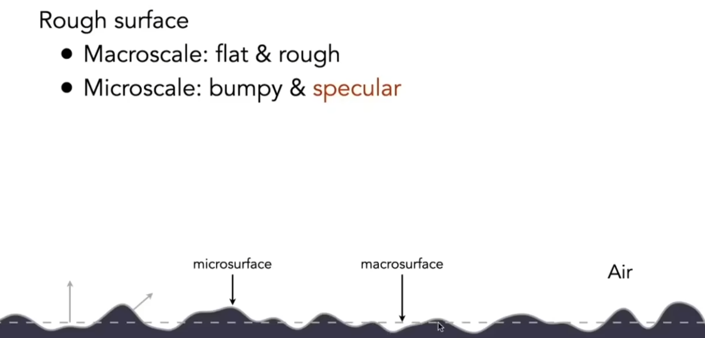
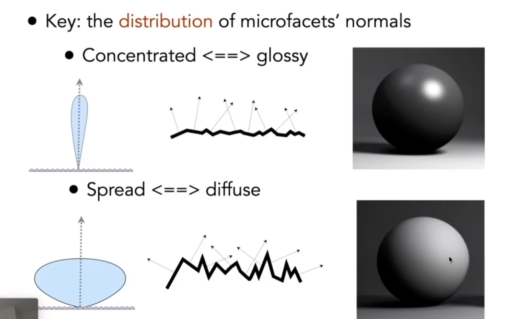
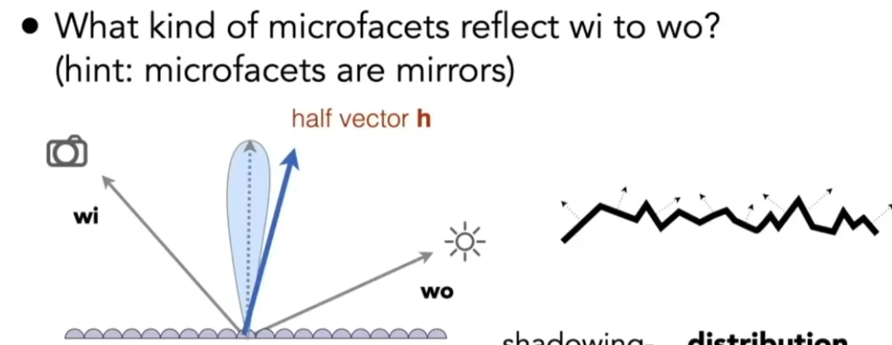
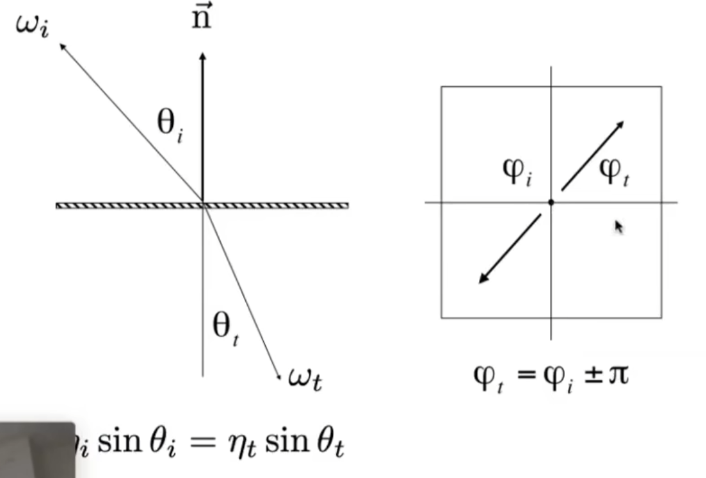
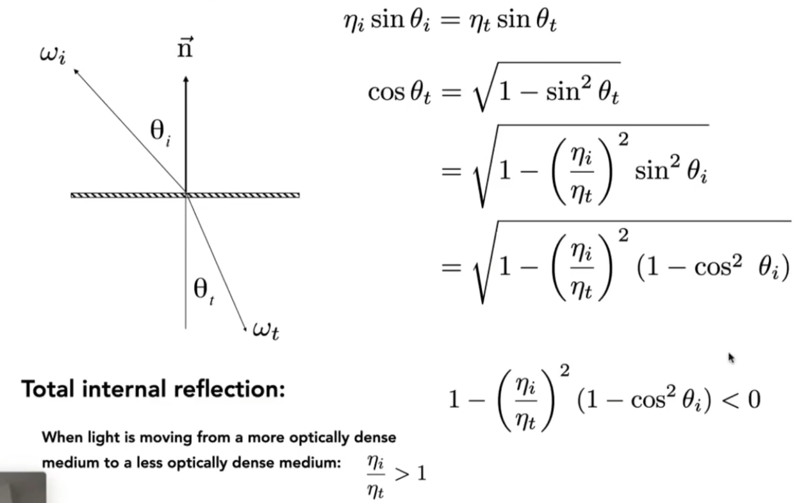
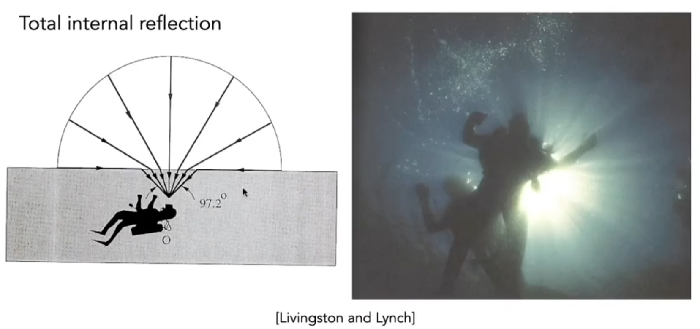
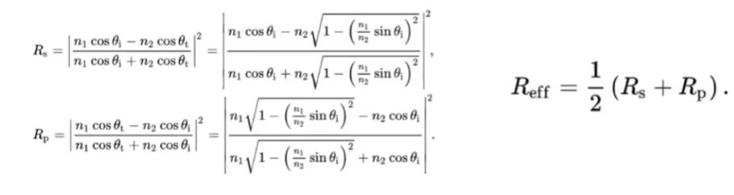
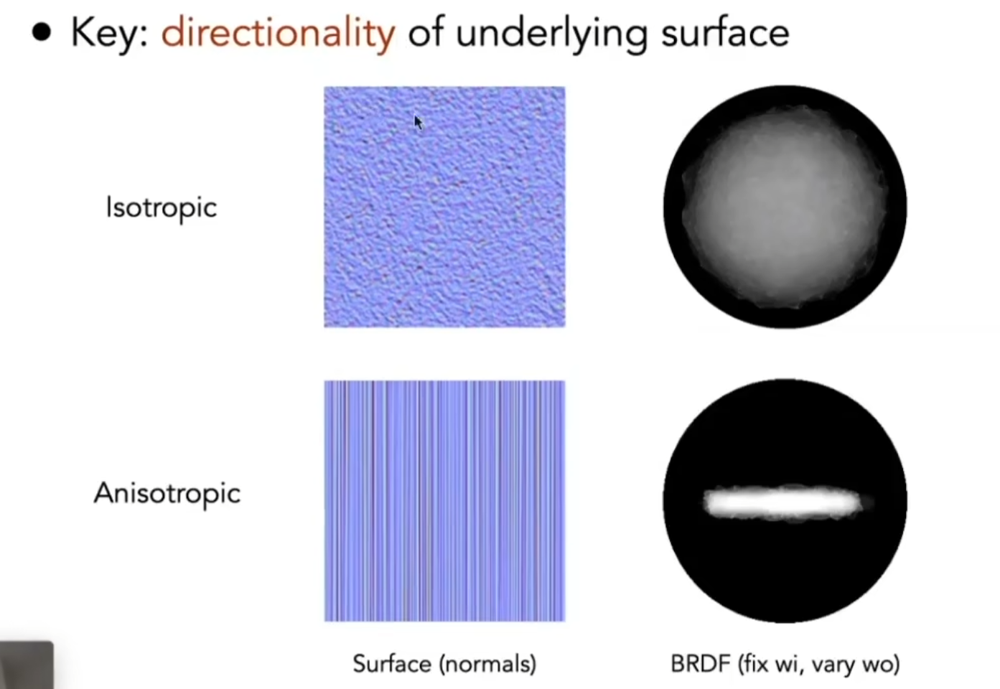
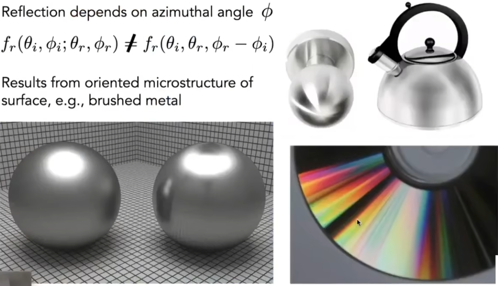
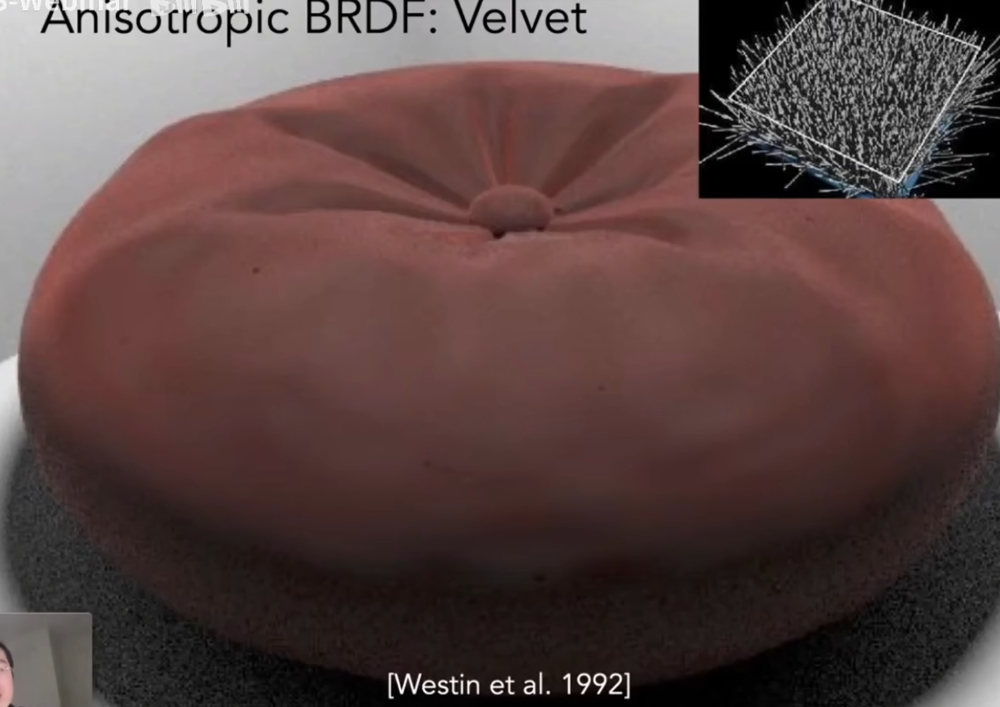

# 材质
在计算机图形学中，**材质**定义了一个物体如何与光线进行交互
不同的材质（如金属、玻璃、木材、皮肤）之所以看起来千差万别，根本原因在于它们以各自独特的方式反射、吸收和透射光线

我们使用**双向散射分布函数 (BSDF)** 来从物理上描述材质。BSDF由两部分组成：
1. **BRDF (Bidirectional Reflectance Distribution Function)**: 描述光线如何被**反射**
2. **BTDF (Bidirectional Transmittance Distribution Function)**: 描述光线如何被**透射**（即折射）
因此，一个材质的最终外观，就是由其独特的BSDF决定的

# 表面反射模型 BRDF
上一节我们已经介绍了 BRDF 的基础原理，其描述了从任意方向入射的光线，会以怎样的能量分布被反射到各个出射方向上。下面我们介绍几种核心的BRDF模型
## 理想漫反射 (Ideal Diffuse / Lambertian)
**外观**: 完美的哑光、无光泽表面，例如粉笔、石膏墙 
**特性**: 当光线射入后，会向所有方向**均匀地**散射出去。因此，无论你从哪个角度观察，表面的亮度都是一样的

**BRDF函数**: 一个常数 $f_r = \frac{\rho}{\pi}$
-  $\rho$ 是**反照率 (Albedo)**，代表了表面的基底色，取值范围 \[0, 1\] 
- 分母中的 $\pi$ 是一个归一化因子，用于保证能量守恒

## 理想镜面反射 (Ideal Specular)
**外观**: 完美的镜子或平静无波的水面
**特性**: 入射光只会被反射到**唯一一个**确定的方向（入射角等于反射角）

**BRDF函数**: 在数学上用狄拉克δ函数 (Dirac Delta Function) 表达，表示只在完美反射方向上有值，其他方向都为0 。在路径追踪中，我们**通常不会对这种BRDF进行积分采样**，而是直接计算出唯一的反射光线

## 微表面模型 (Microfacet Model)
这是现代PBR（Physically Based Rendering）的**核心模型**，用于模拟从磨砂到光滑的各种真实世界材质

**核心思想**: 宏观上平整的物体表面，在微观尺度上是**粗糙不平**的，由大量**朝向各异**的微小镜面（**Microfacets**）组成。表面的整体外观由这些微表面的集体行为决定

**微表面BRDF公式**: 通常由以下三个函数相乘得到 ：
$$
f_{r}=\frac{D\cdot G\cdot F}{4(n\cdot \omega_{o})(n\cdot \omega_{i})}
$$
1. **D - 法线分布函数 (Normal Distribution Function)**: 描述了微表面的朝向在统计上的**分布情况** 。其核心作用是控制材质的**粗糙度 (Roughness)** 。表面越光滑，微表面法线越集中于宏观法线方向；表面越粗糙，法线朝向越混乱
2. **G - 几何函数 (Geometry Function)**: 描述了微表面之间的**自遮挡现象**（阴影和遮蔽） 。当视线或光线以一个掠射角度到达表面时，一些微表面可能会被其他微表面挡住
3. **F - 菲涅尔方程 (Fresnel Equation)**: 见下文详解

# 折射与菲涅尔效应
当光线从一种介质（如空气）传播到另一种介质（如水或玻璃）时，一部分光会被**反射**，另一部分则会穿过介质边界并改变传播方向，这种现象就是**折射 (Refraction)**
## 折射定律

光线折射时遵循斯涅尔定律，它描述了入射角和折射角之间的关系：
$$
n_{1}\sin \theta_{1}=n_{2}\sin \theta_{2}
$$
其中 $n_1$ 和 $n_2$ 分别是两种介质的**折射率 (Index of Refraction, IOR)**，$\theta_1$ 和 $\theta_2$ 分别是入射角和折射角。折射率越高的介质，光在其中传播越慢，偏折也越厉害

当光线从高折射率介质射向低折射率介质 $(n_1​>n_2​)$，且入射角大于由 $\sin \theta_{c}=\frac{n_{2}}{n_{1}}$ 定义的临界角时，会发生全反射现象，所有光线都会被反射回原介质

那么，到底有多少比例的光被反射，多少比例被折射呢？
- 菲涅尔方程回答了这个问题
## 菲涅尔项
菲涅尔项是光学中的一个概念，用于描述光波在从一种介质入射到另一种介质时反射和折射光的比例如何随入射角而变化

观察上图，其展示了非常明显的菲涅尔效应
- 当光线以较小的角度（几乎垂直于表面）入射到材质表面时，大部分光线会透过材质；
- 而当光线以较大的角度（接近平行于表面）入射时，反射的光线会变得更强
这一效应解释了为何物体的边缘在视觉上通常会比中心部分看起来更亮

物理上根据**入射角度**、**两种介质的折射率**以及**光的偏振**，计算出光能的反射率

这个公式的计算量大且复杂，通常使用简化的、非偏振的**Schlick 近似**：
$$
\begin{align}
R(\theta)&=R_{0}+(1-R_{0})(1-\cos \theta)^5 \\
R_{0}&=\left(\frac{n_{1}-n_{2}}{n_{1}+n_{2}}\right)^2
\end{align}
$$
- $R(\theta)$ 是入射角 $\theta$ 下的反射率
- $R_{0}$ 是垂直入射的反射率
- $\cos \theta$ 是入射角的余弦值
这个公式可以根据不同的材质特性来调整 $R_{0}$ 的值

# 各项异性与各项同性
 微表面材质中，各向同性法线分布相对均匀，而各向异性法线分布具有一定明确的方向性
## 各向同性 Isotropic
**定义**: 如果一个材质的性质不随方向的改变而变化，那它就是各向同性的。具体到材质反射，就是当你围绕其表面法线旋转这个表面时，它的反光特性（高光、粗糙度等）**不会发生任何改变**

这意味着其微表面的朝向是**完全随机**的，在所有方向上的统计分布都是**一致**的。你可以想象一个被均匀喷砂处理过的表面

**视觉效果**: 各向同性材质的高光总是**对称的、圆形的**

## 各向异性 Anisotropic

**定义**: 如果一个材质的性质会随着方向的改变而变化，那它就是各向异性的。当你围绕其表面法线旋转它时，它的反光特性会发生改变

这通常意味着其微观结构上存在一个**明确的方向**。例如，表面布满了朝向同一个方向的、细微的凹槽、划痕或纤维

**视觉效果**: 各向异性材质的高光会被**拉伸或延长**，呈现出非圆形的形状。高光的拉伸方向通常**垂直于**微观结构中凹槽或纤维的方向

