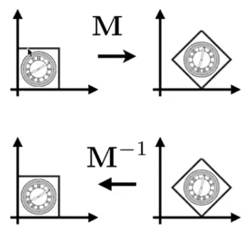
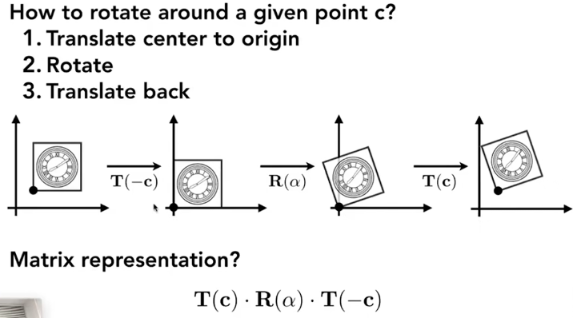

# 统一集合变换
在二维空间中，对一个点的旋转或缩放操作可以优雅的用矩阵相乘表达，而平移是一个加法操作：
$$
\left[\begin{matrix}
x' \\
y'
\end{matrix}\right]=\underbrace{\left[\begin{matrix}
a&b \\
c&d
\end{matrix}\right]\left[\begin{matrix}
x \\
y
\end{matrix}\right]}_{\text{旋转/缩放(乘法)}}+\underbrace{\left[\begin{matrix}
t_{x} \\
t_{y}
\end{matrix}\right]}_{平移(加法)}
$$
这种“乘法与加法并存”的形式，称为**仿射变换**，在计算上很不方便，例如，如果我们想对一个物体进行“先旋转再平移”的复合操作，就需要分两步计算。我们的目标是找到一种方法，将**所有变换都统一为单一的矩阵乘法操作**，这样就可以将多个变换预先组合成一个矩阵，极大地提高效率

解决的方案就是引入**齐次坐标**：将二维坐标提示到一个三维空间中，引入一个额外的 w 坐标
$$
\left[\begin{matrix}
x' \\
y' \\
w'
\end{matrix}\right]=\left[\begin{matrix}
a&b&t_{x} \\
c&d&t_{y} \\
0&0&1
\end{matrix}\right]
\left[\begin{matrix}
x \\
y \\
1
\end{matrix}\right]$$
- 好处：分离性、适应性、更多的信息
- 代价：存储代价、在高维时数据的稀疏性会增加（维度诅咒）

## 区分点和向量
w 坐标的引入提供了一个优雅的机制来区分几何中的两种基本元素：
- 对于点，我们将其 w 坐标设为 1，因为它代表一个具体的位置
- 对于向量，我们将其 w 坐标设为 0，因为它只代表方向和大小，不应受平移的影响。我们可以根据这个性质分辩向量和点

## 移动矩阵
在齐次坐标下，我们可以得到如下的移动矩阵（仿射变换矩阵）
[1]缩放：$\left[\begin{matrix}S_{x}&0&0 \\ 0&S_{y}&0 \\ 0&0&1\end{matrix}\right]$
[2]旋转：$\left[\begin{matrix}\cos \alpha&-\sin \alpha&0 \\ \sin \alpha&\cos \alpha&0 \\ 0&0&1\end{matrix}\right]$
[3]平移：$\left[\begin{matrix}1&0&t_{x} \\ 0&1&t_{y} \\ 0&0&1\end{matrix}\right]$
由于矩阵乘法不满足交换律，所以变换顺序至关重要，变换需要按从右到左的顺序应用

注意到所有的移动矩阵第三维都是 001，故可以在存储时省略

## 齐次坐标下的代数意义
w 坐标的设置使点和向量的运算具有了明确的集合意义
- 向量+向量=向量（0+0=0）
- 点+向量=点 (1+0=1)
- 点-点=向量 (1-1=0)
- 点+点=？
这就引出了齐次坐标的归一化：
$$
\left[\begin{matrix}x\\y\\w\end{matrix}\right]=\left[\begin{matrix}x/w\\y/w\\1\end{matrix}\right],w\neq 0
$$
所以点+点=中点

## 可逆性
由图：

可以直观的看出所有的变换矩阵都是可逆的，数学证明如下：
- 由于变换矩阵是由缩放、旋转、平移矩阵组合得到的，这些基础矩阵在系数非0时都是可逆的，而逆矩阵的组合可逆

由于旋转矩阵是一个规范正交矩阵，所以他的逆为它的转置
$$
R_{\theta}=\left[\begin{matrix}\cos \alpha&-\sin \alpha&0 \\ \sin \alpha&\cos \alpha&0 \\ 0&0&1\end{matrix}\right],R_{-\theta}=\left[\begin{matrix}\cos \alpha&\sin \alpha&0 \\ -\sin \alpha&\cos \alpha&0 \\ 0&0&1\end{matrix}\right]=R_{\theta}^T
$$

# 如何得到不是绕着原点旋转的矩阵
先用将旋转中心移动为原点，再进行旋转，然后再将旋转中心移动回去

## 推广
上述性质都能自然的推广到三维空间。
特别说下旋转矩阵，在二维空间下的旋转矩阵可以看成是绕一个不存在的 Z 轴旋转的，那三维空间中（简单）的旋转也可以看成是绕 x 轴、y 轴旋转，选择方向可以用右手螺旋定则快速判断：拇指指向旋转轴正方向，其余四指旋转方向为正向。（注意右手螺旋定则只适用于右手系，左手螺旋定则只适用于左手系）