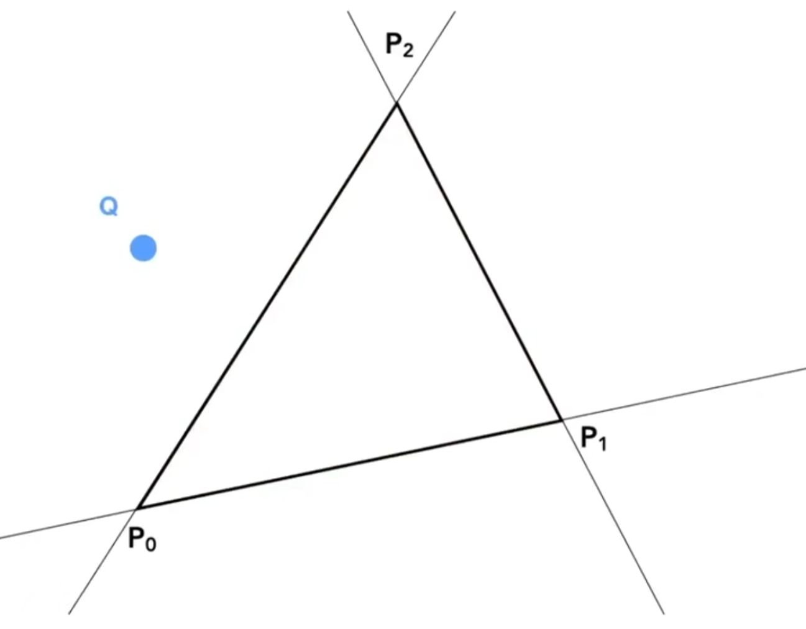
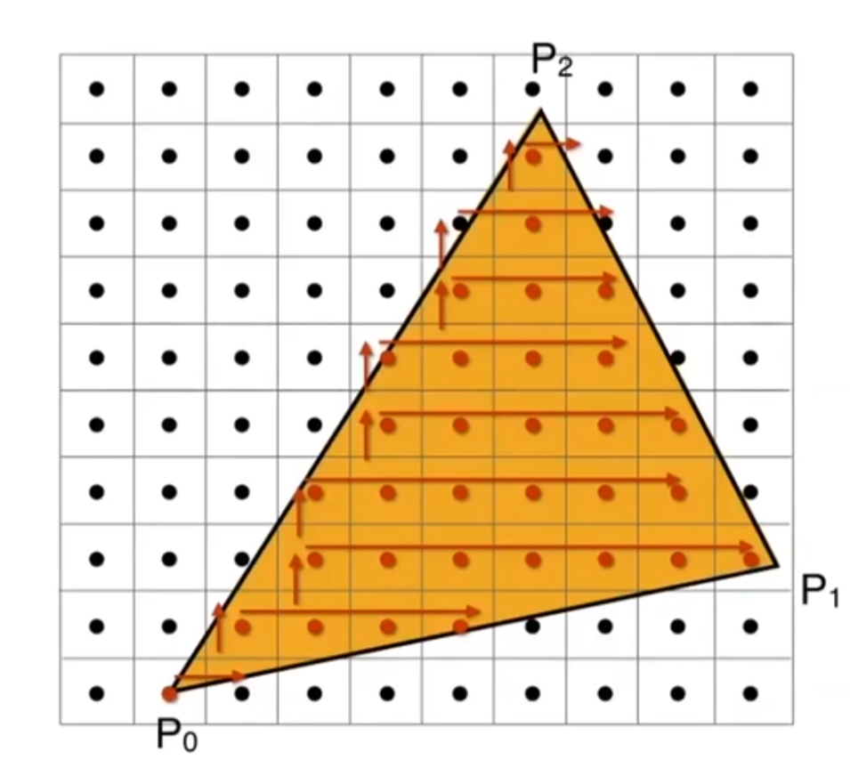

# 基础概念
光栅化 Raster：将矢量图形（例如，由顶点定义的三角形）转化为像素集合的过程
像素 Pixel：可以认为是一个小方块，每个方块内部的颜色（颜色可以被分为红绿蓝混合）
屏幕空间 screenspace：

像素坐标：左下角点的坐标值表示为像素的坐标 $(x,y)$
实际像素的中心：$(x+0.5,y+0.5)$

# 如何从 $[-1,1]^3$ 转换到屏幕上：
本节先不考虑 z 造成的遮挡问题，只讨论 x, y 的映射问题，故为 $[-1,1]^2$ 范围变换到屏幕范围 $[0,width]\times[0,height]$
易得视口变换（对 z 不改变）：
$$
M_{viewport}=\left[\begin{matrix}
\frac{width}{2}&0&0&\frac{width}{2} \\
0&\frac{height}{2}&0&\frac{height}{2} \\
0&0&1&0 \\
0&0&0&1
\end{matrix}\right]
$$
其中第四列是因为左下角是 $(0,0)$ 而做的平移替换

但此时仍然是连续的数学函数，还需要**离散化**为像素点在屏幕上

# 三角形
Q：为什么图形学选择三角形作为网格的基础元素
A：由于三角形的性质
- 是**最简单的多边形**，任何多边形都可以拆成三角形的组合
- **三点必为一平面**，其他多边形可对折
- 易于**区分内外**
- 便于插值

## 区分内外

简单思路：**叉乘的正负**可以视作为在向量的左右两端，如果对三条边（顺时针或逆时针顺序）都**同正或同负**则视为在三角形**内部**，**否则则为外部**
注意：如果叉乘为 0 则代表点**在边上或顶点上**，这样则的**边界处理可以由自己判断**

# 光栅化的过程
判断像素的中心点是否在需要绘制的范围内，如果在，则绘制该点

## 采样 Sample
将一个函数离散化的过程，是一种重要的思想
采样的形式很多，例如视频采样：视频是离散的一帧一帧
人眼实际上也是采样的

此处是光栅化最简单的一种方法：判断像素的中心是不是在三角形内

## 加速采样的方法
目的:缩小对于是否需要考虑绘制的像素范围减少计算量

### Bounding Box（BBox）法
BBox可以由三角形三顶点的最大最小值确定，构建出蓝色的轴内包围盒（axis alined bounding box 所写为AABB）

###  Incremental Triangle Traversal 法
适用于比较窄长的三角形

这样每行的像素是否需要绘制只需要记录首尾
