# 可见性问题
在三维场景渲染中，我们需要决定哪个物体在前，哪个在后，以正确处理遮挡关系

## 画家算法Painter's Algorithm
像油画一样，先绘制距离远的物体，再一层层绘制距离近的物体，用后者覆盖前者

绘画顺序很大程度决定了遮挡关系，比较难以确定遮挡，且无法处理复杂的遮挡情况
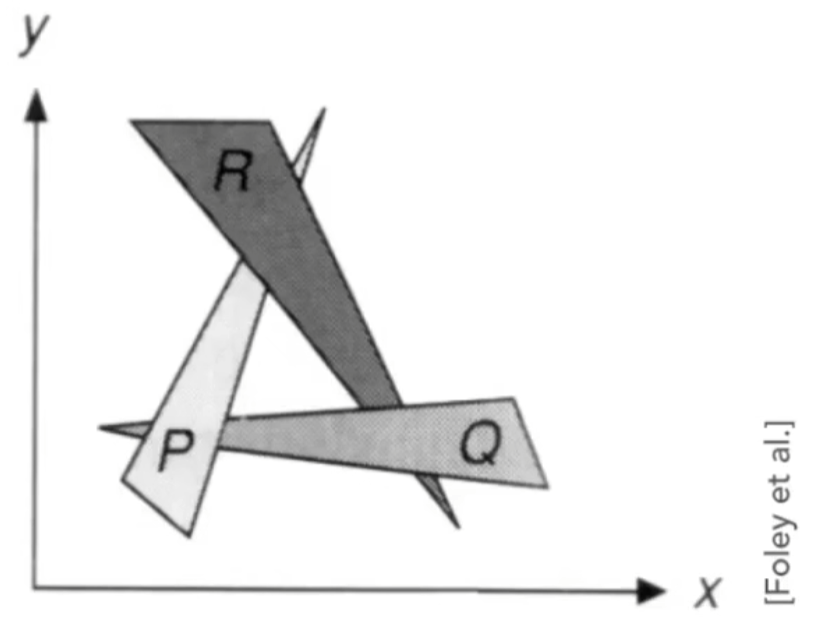

## 深度缓存Z-Buffer
动态记录屏幕上每个像素离我们最近的距离，如果有物体在该像素上的距离小于深度缓存，就刷新深度缓存并写入像素（维护最小值）

注意：相机看向的是 z 轴的负距离，则 z 值越大越近，越小越远
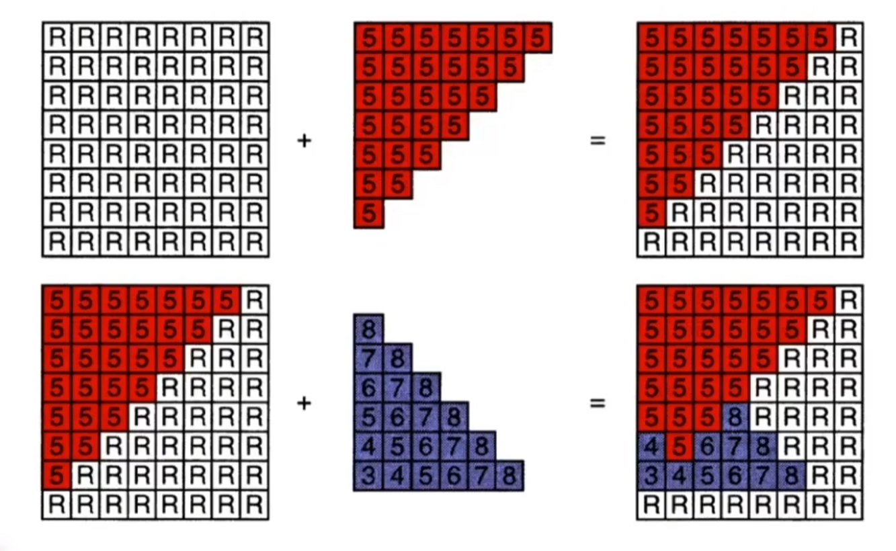
**算法流程**:
1. **初始化**
    - 创建一个**深度缓冲区 (z-buffer)**，其尺寸与屏幕分辨率相同，并将所有像素的深度值初始化为**无穷大 (∞)**。
    - 创建一个**帧缓冲区 (frame-buffer)**，用于存储最终颜色，并将其初始化为背景色。
2. **渲染循环**
```cpp
for (each triangle T in the scene) {
    for (each pixel (x, y) covered by T) {
        // 计算该像素的深度 z
        // 检查该像素是否比 z-buffer 中已记录的更近
        if (z < zbuffer[x, y]) { 
            framebuffer[x, y] = color_of_T; // 更新像素颜色
            zbuffer[x, y] = z;             // 更新深度记录
        }
        // else, 这个像素点已经被一个更近的物体占据，什么也不做
    }
}
```
**特性与局限**:
- 算法复杂度为 O(n)，n 为总像素数，与场景中物体的数量无关
- 渲染结果与物体的绘制顺序无关
- 无法直接处理半透明物体，因为它只会保留最近的物体，而不会混合颜色


# 着色器
确定了像素的可见性后，我们需要计算它应该是什么颜色（对不同的物体应用用不同的材质进行着色），这个过程就是**着色 (Shading)** 

## Blinn-Phong 模型
基础的着色模型，将光照分解为三个部分：**漫反射 (Diffuse)**、**高光 (Specular)** 和 **环境光 (Ambient)**
特点：
- **局部光照、无法处理阴影**: 只考虑从光源直接照射到物体表面的光线，不考虑光线是否真的到达了这个点，或者是否被其他物体挡住了（即无法产生真实的阴影）
- 漫反射系数被设置为常量

计算一个点的光照，需要的输入有：
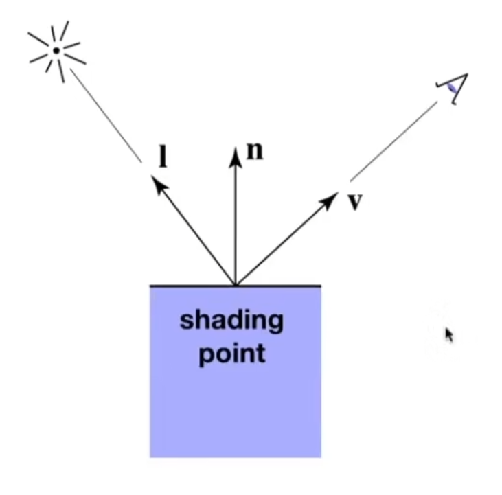
- 观察者的方向向量v
- 着色点所在表面的法向量n
- 光线照射的方向向量L
- 着色点的表面参数（颜色，材质，反光度等）

### 漫反射
当光线照射到粗糙的物体表面时，会向所有方向均匀地散射出去。因此，我们从任何角度观察，该点的颜色都是一样的，其亮度与观察方向 v无关（是指在点光源下那一点发出的颜色、现实要复杂得多，比如多光源、阴影和路径上的水雾等东西）

#### 光线入射角度
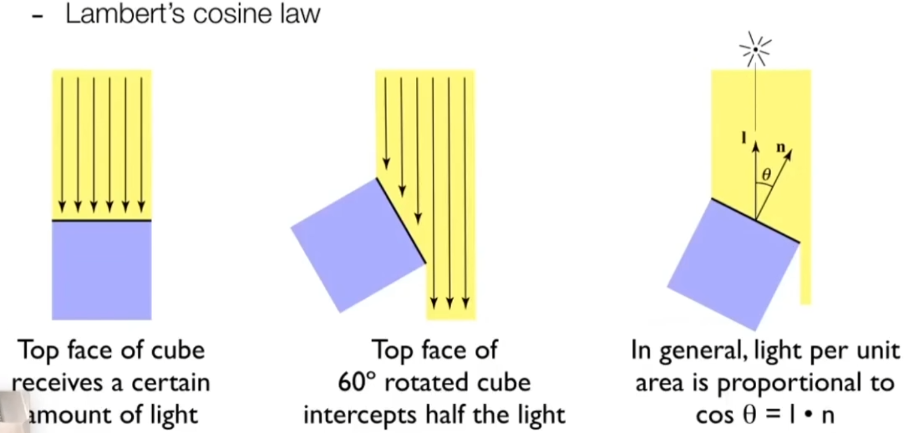
在极小的单位面上可以将光线看成是离散的，图中每一根光线都代表着一股能量，如果物体表面与光线垂直，那么可以接受到所有的光线能量，如果物体表面进行了旋转那么能收到的光线根数会变少，则物体的表面会变暗。
由此得到结论：物体表面的法线和光线的夹角决定了物体表面应该有多亮，即为琅勃余弦公式 Lambert's Cosine Law
$$
E=E_{0}\cdot \cos \theta
$$
- $E$ 为表面接收到的辐射度（单位面积上的光通量）
- $E_0$ 为入射光线的辐射度
- $\theta$ 为光线入射方向与表面法线之间的夹角

#### 光衰减
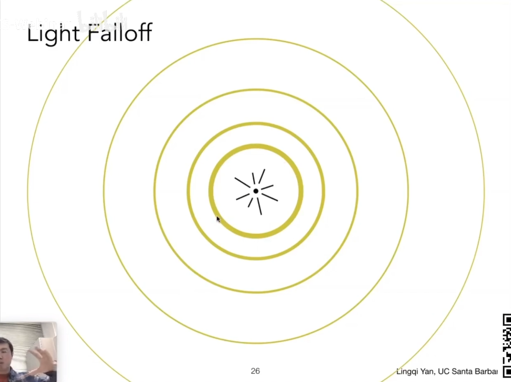
上图是一个点光源往四面八方发射光能量

假设光线在传播过程中不发生能量损失，那么同一瞬间里点发出的光在经过相同时间后，光线的终点可以围成一个球体。
点光源在每个瞬间里发出的能量是固定的，那么**每个球壳上的能量大小也是固定的**，由此球**壳上每一点的能量大小只与球壳的面积有关**，也就是**只与离点光源的距离有关**
即距离越远，光照强度越弱
按照图中所示，我们假设**在半径为 1 的这个球壳上**所蕴含的能量为 $k$，而在这个球壳上的每一点的光的强度是 $I$，那么在半径为 $k$ 的球壳上，在这个球壳上的光线的强度就应该是 $\frac{I}{r^2}$

#### 物体表面材质
物体表面会吸收一部分光能，只反射剩余部分。这个吸收/反射的比例由材质的漫反射系数 $k_d$ 决定，它通常代表了**物体本身的颜色、材质**
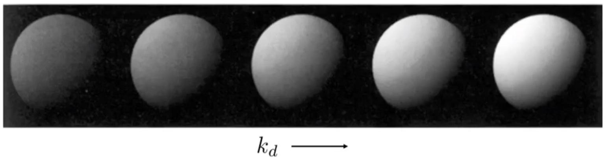
kd 逐渐增大的效果

#### 最终的漫反射光照公式
将以上三点结合，我们得到完整的漫反射光照计算公式
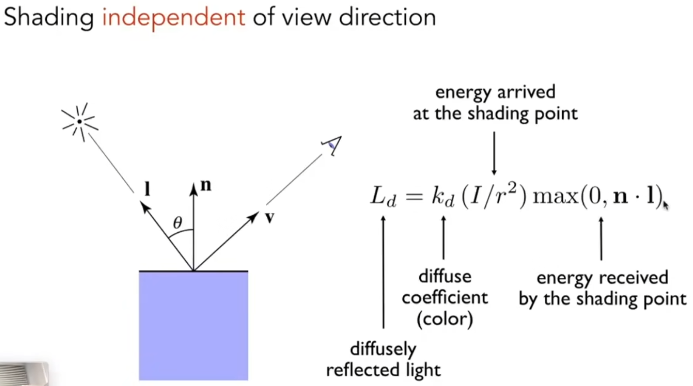

`max` 函数的解释：当l和n的方向相反时，得到的结果时负数，此时光线穿过了物体，在不考虑折射的情况下，直接为 0

### 高光反射
高光是照射在光滑物体表面上的光源所形成的明亮斑点。
- **出现条件**：当物体表面足够光滑（接近镜面）时，光线会以接近镜面反射的方式被反射。如果观察者的方向 恰好与镜面反射方向非常接近，就能看到高光
- **视觉效果**：高光区域会显得异常明亮，模拟了现实世界中光滑材质（如金属、塑料、陶瓷）的反光效果
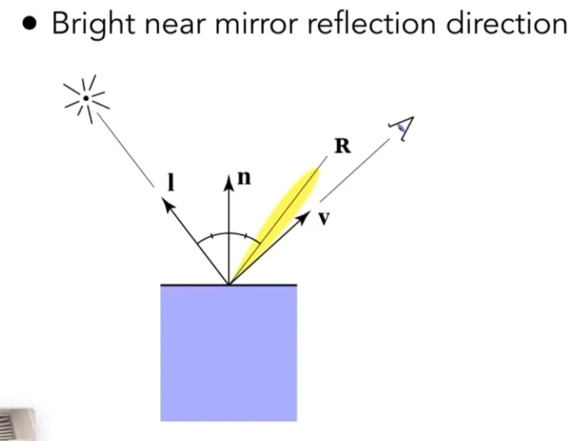


#### Blinn-Phong 模型对于高光项的处理方法
直接计算并使用反射向量 $R$ 的成本较高。Blinn-Phong 模型采用了半程向量来近似这个效果
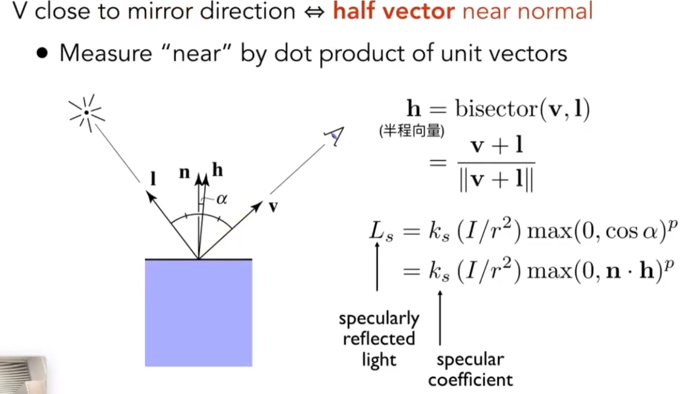
- **判断是否接近的方法**：通过计算法线和半程向量的点积（即它们之间夹角的余弦值）来衡量它们的接近程度
- **为什么加入指数项p**：p用于调整容忍度，控制高光分布的锐度和范围
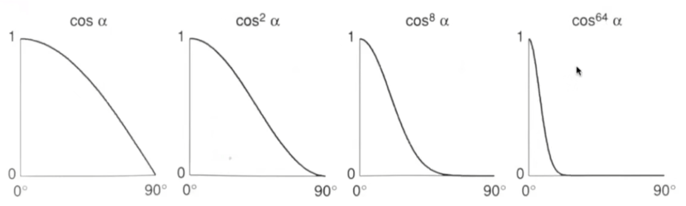
上图显示，p值越高，函数曲线越陡峭，意味着只有当视线与反射方向的偏差极小时，高光才可见
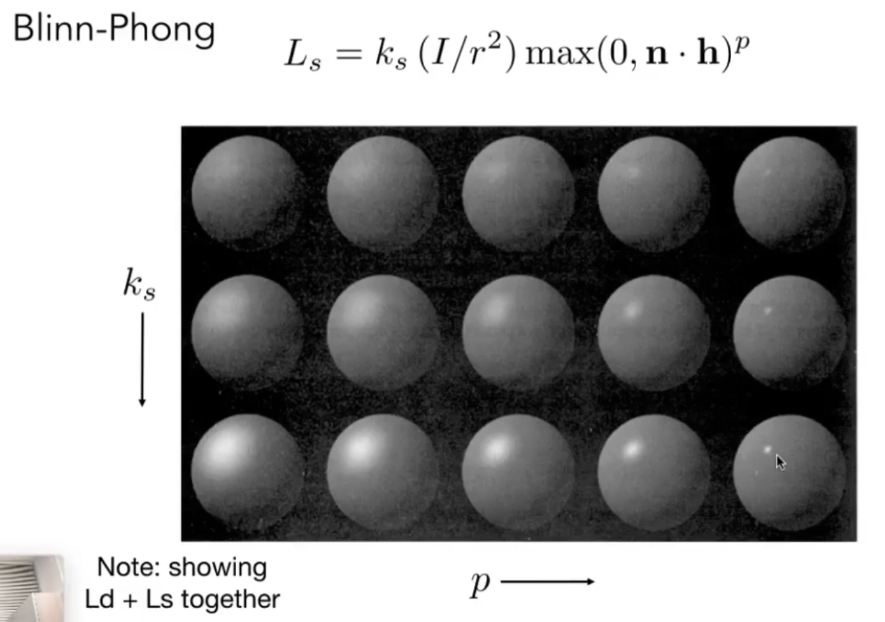
**视觉效果**：
- **低 `p` 值** (如 2-16): 产生范围大、模糊的高光，适用于模拟磨砂塑料或石材等不太光滑的材质
- **高 `p` 值** (如 100-200): 产生范围小、清晰锐利的高光，适用于模拟高度抛光的金属、玻璃等非常光滑的材质


### 环境光照
不直接来自光源的光线，而是由于经过反射或折射所来到渲染点的光线（非常复杂）
#### Blinn-Phong 模型简化
将环境光简化为一个全局常数或场景中定义的环境光颜色，即环境光是一个常数
简化忽略了环境光在空间中的变化，以及不同物体间的光照相互作用

深入研究需要研究全局光照


###  Blinn-Phong 模型总结
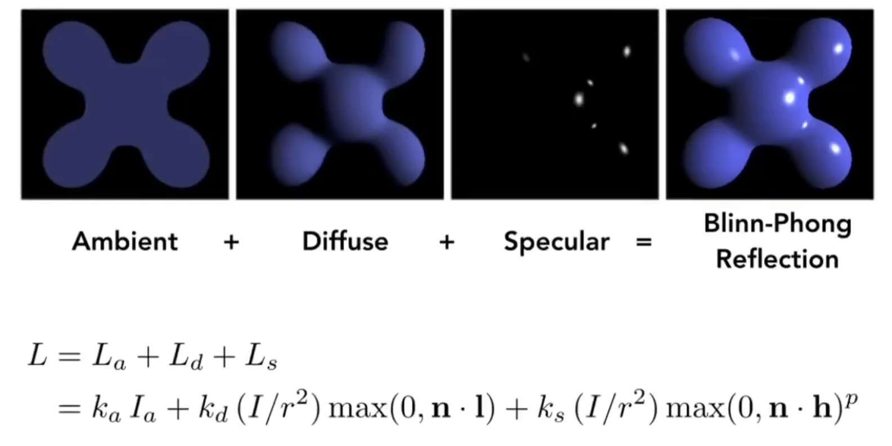

# 顶点法线
为了计算光照，我们必须知道物体表面的朝向，这由**法线向量 (Normal Vector)** 来定义

最基础的法线是**面法线**，即每个三角形平面的法线。一个平面的法线是唯一的，计算简单

为了模拟平滑的曲面（如球体），我们不能让每个三角面都呈现硬朗的边缘。因此，我们需要为模型的每个**顶点**定义一个法线
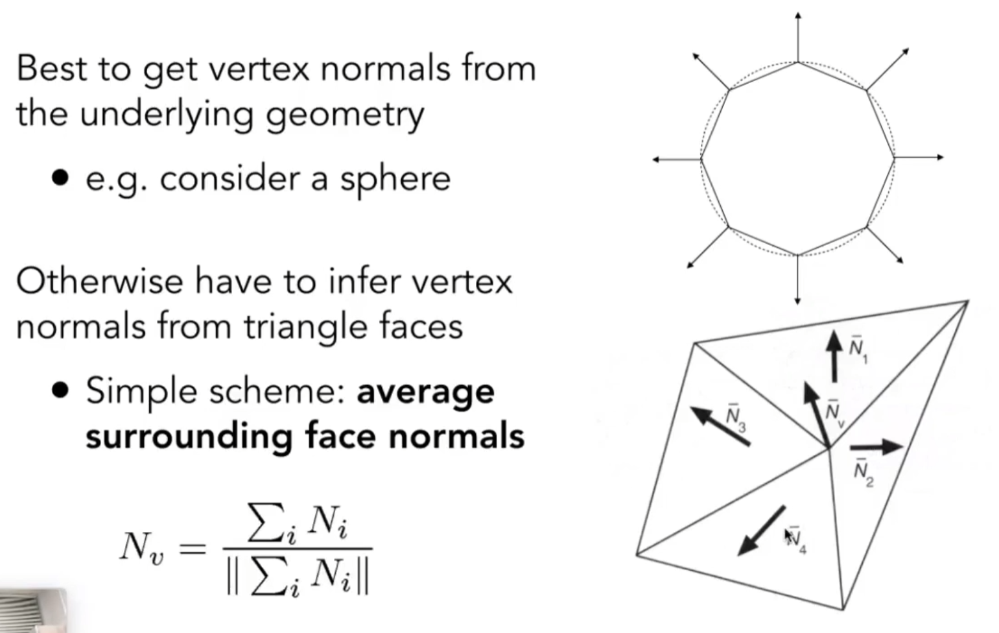
求出与顶点相邻的所有三角形的法线方向，计算所有法线的**平均或加权平均**（即进行归一化处理）
权重的选择：
- 面积权重能更好的反映较大面的影响
- 顶点角度权重能考虑到曲面的局部曲率

# 着色频率
**着色频率**指的是光照计算的**粒度**——即我们是在每个面、每个顶点还是每个像素上执行完整的光照计算
## 平面渲染 Flat shading
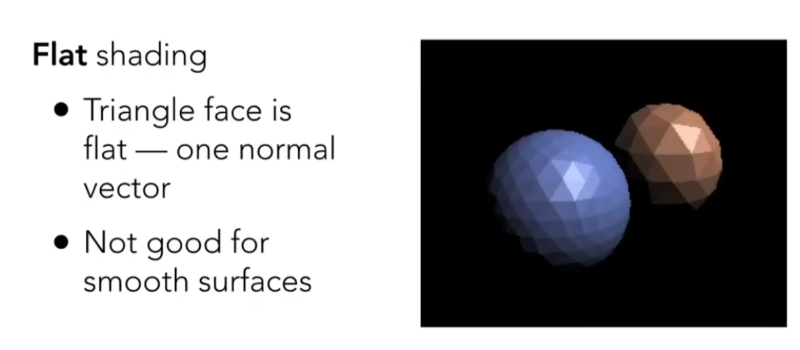
根据每个平面的法向量对平面进行统一着色
对光滑表面效果不佳

## 高洛得渲染 Gouraud Shading
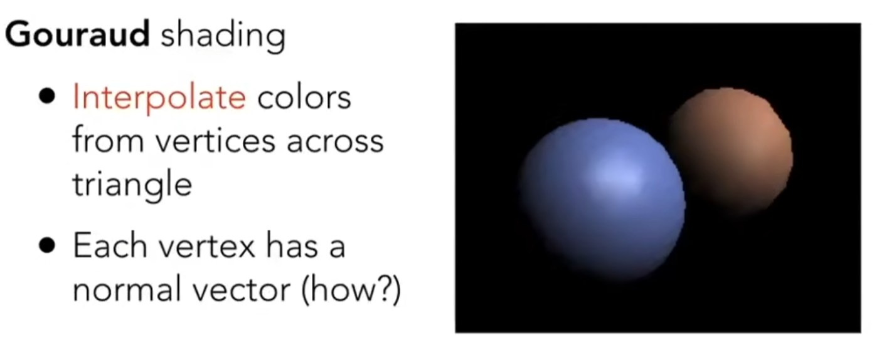
先求出三角形三个顶点的法线方向，对每个顶点进行着色
再通过颜色插值填充三角形中每个颜色的的颜色
插值方法以后会讲

## 补色渲染 Phong Shading
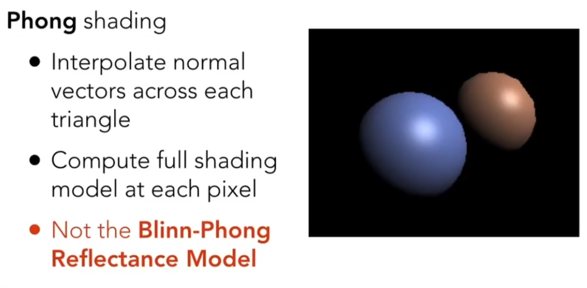
求出三个顶点的法线方向，通过三角形内部插值得到三角形每个像素的法线方向，根据每个像素的法线对像素着色
对应着 shader 里的片元着色器

## 着色频率与顶点个数的关系
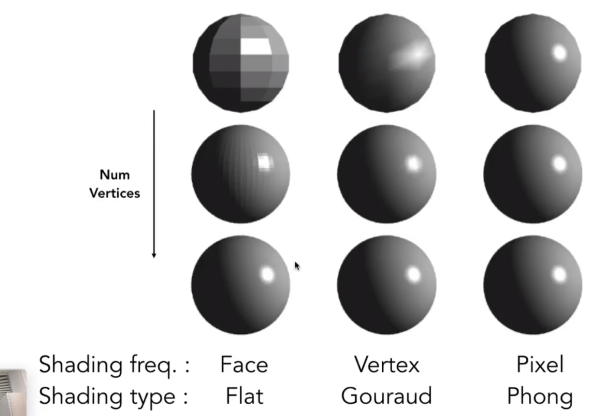
在顶点个数相同的情况下，着色效果 Phone Shading>Gouraud Shading>Flat Shading
但是代价也是会相应增加
随着顶点个数的增加，三种着色频率的着色效果差距越来越小。在顶点个数很多的情况下，平面渲染也可以有较好的着色效果


