# 基础工具
## 重心坐标
重心坐标是在一个三角形所在平面上定义的特殊坐标系。该平面上的任意一点 $P$，都可以表示为三角形三个顶点 $A、B、C$ 的线性组合

如图，点 $(x,y)$ 相对于三个顶点 $A、B、C$ 的重心坐标为 $(\alpha、\beta、\gamma)$
 $\alpha+\beta+\gamma=1$ 是为了限制点在 $ABC$ 所在的面上，但**不保证在三角形内部**
 
$(x,y)$ 在三角形内（包括边界）的条件为 $\alpha、\beta、\gamma\geq 0$，证明如下：
已知三点 $A、B、C$ 的坐标，选择 $A$ 作为参考点，则
$$
\vec{AB}=B-A,\vec{AC}=C-A
$$
则 $A、\vec{AB}、\vec{AC}$ 可以建立起平面上的一个坐标系，平面上任意一点 $P$ 可以被表达为
$$
P=A+s\cdot \vec{AB}+t\cdot \vec{AC}
$$
由此易知当 $s、t\leq 1$ 且 $s+t\leq 1$ 时，点 $P$ 在三角形内部
展开表达式得：
$$
P=A+s\cdot(B-A)+t\cdot(C-A)=(1-s-t)A+sB+tC
$$
即 $\alpha=(1-s-t),\beta=s,\gamma=t$ 且 $\alpha+\beta+\gamma=1$
而 $s、t\geq 0$ 且 $s+t\leq 1$ 等价于 $\alpha、\beta、\gamma\geq 0$

## 公式
在三维情况下有
$$\begin{cases} x = \alpha x_A + \beta x_B + \gamma x_C \\
 y = \alpha y_A + \beta y_B + \gamma y_C \\
 z= \alpha z_A+\beta z_{B}+\gamma z_{C}\\
 1 = \alpha + \beta + \gamma \end{cases} $$这个方程组可以利用约束条件 $\gamma=1−\alpha−\beta$ 来降维，由于**此时只有两个未知数**，所以我们可以暂时搁置 $z$ 维度
 $$\begin{cases} x = \alpha x_A + \beta x_B + (1-\alpha-\beta)x_C \\ y = \alpha y_A + \beta y_B + (1-\alpha-\beta)y_C \end{cases} $$
 整理后得到一个关于 $\alpha, \beta$ 的2x2线性系统
 $$ \begin{cases} \alpha(x_A - x_C) + \beta(x_B - x_C) = x - x_C \\ \alpha(y_A - y_C) + \beta(y_B - y_C) = y - y_C \end{cases} $$
其矩阵形式为：
$$ \begin{bmatrix} x_A - x_C & x_B - x_C \\ y_A - y_C & y_B - y_C \end{bmatrix} \begin{bmatrix} \alpha \\ \beta \end{bmatrix} = \begin{bmatrix} x - x_C \\ y - y_C \end{bmatrix}$$
易得
$$
\begin{bmatrix} \alpha \\ \beta \end{bmatrix} = \begin{bmatrix} x_A - x_C & x_B - x_C \\ y_A - y_C & y_B - y_C \end{bmatrix} ^{-1} \begin{bmatrix} x - x_C \\ y - y_C \end{bmatrix}
$$ (使用几何法也容易证明)

## 利用重心坐标进行顶点插值
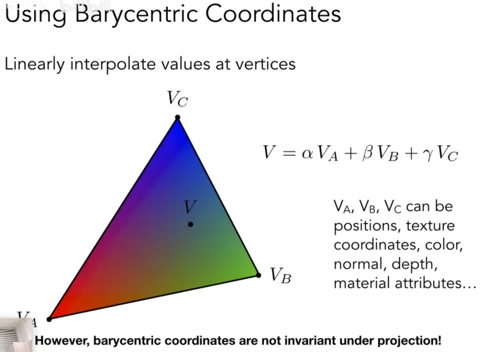
特别注意：
- 在进行投影变换后重心坐标会发生改变，无法正确的表示相关关系以进行正确的插值，所以我们需要补正

# 透视修正
通过上面的学习：
1. 我们已经知道如何把一个三维三角形投影到二维屏幕上。
2. 我们可以在这个二维的**屏幕三角形**上，很轻松地为每一个像素计算出它的重心坐标。
3. 我们也可以在原始的**三维三角形**上，为空间中的任意一个点计算出它的重心坐标。
**那么，引出一个关键问题：**
能不能偷个懒，直接用那个在二维屏幕上算出来的、简单的重心坐标，去插值那些本应该在三维空间中定义的属性（比如纹理坐标 `uv`、深度 `z`、法线 `normal`）呢？这两种方法得到的结果是一样的吗？
换句话说：**线性插值在屏幕空间中的行为，是否等同于它在三维世界空间中的行为？**

这个问题的答案是**不可以，它们完全不等价**，而这正是引入**透视修正 (Perspective Correction)** 的根本原因
- **为什么不等价？** 因为**透视投影**是一种**非线性**的变换。一个在三维空间中位于三角形几何中心的点，经过透视投影后，在屏幕上看起来**不一定**在投影后三角形的几何中心
- **如果直接用屏幕空间的插值会发生什么？** 如果直接用屏幕空间的重心坐标去插值三维属性，就会得到**错误的、扭曲的结果**
 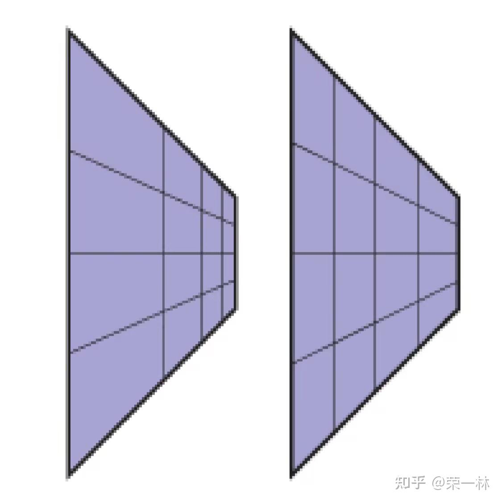
 虽然整体的型不变，但是内部的颜色属性插值出了问题。
 直觉告诉我们，左边的图片会显得更加符合直觉，这是因为在透视投影中会营造一种**近大远小**的视觉现象，并且**越远离视点的部分被压缩的程度也会越大**。
 右边图片直接利用端点在**屏幕空间**中的坐标进行纹理坐标的插值，导致了一种等间距分布的感觉

## 修正方法
想要修正这个问题也十分简单，只需要对屏幕插值权重做透视投影变换的逆变换就可以得到空间插值权重了（Z 轴与 X、Y 轴共用一个权重，所以不必担心 Z 轴在屏幕上缺失的问题），但这会增加函数的计算开销，效率偏低

### 效率
具体来说
- 一次 $4\times 4$ 矩阵的逆变换使用高斯-若尔当消元法或 LU 分解法求逆的计算复杂度大约为 $O(4^3)$ ，但这个矩阵在同一阵的渲染中通常是不变的，所以这个昂贵的求逆操作只需要执行一次，实际上可以忽略不计
- 主要的计算开销是每像素使用一次 $4\times 4$ 矩阵和 $4D$ 向量的乘法，该操作需要 16  次乘法和 12  次加法，总计 28 次浮点计算
## 高效修正方法
更高效的方法需要利用了一个数学事实：
- 虽然属性 `V`（如纹理坐标 `u`）本身在屏幕空间中不是线性变化的，但是该属性**除以深度 `z`** 后的值，即 `V/z`，在屏幕空间中**是线性变化的**
### 证明
由透视投影变换的知识可知，对于相机坐标系下空间中的一个三维点 $P=(x,y,z)$ 和一个位于 $z=n$ 的图像平面，其投影后的二维点 $P'=(x',y')$ 
$$x'=\frac{n}{z}x,y'=\frac{n}{z}y$$
（这其中除以深度 $z$ 的操作是**非线性变换的原因**）

由在三维空间中任何一个非退化的三角形都唯一地位于一个平面上，其满足如下方程
$$
Ax+By+Cz+D=0
$$
($A,B,C,D$ 是定义该平面的常数，三角形中任何一点都必须满足这个方程)

将透视投影方程代入平面方程中有
$$
A\left( \frac{z}{n}x' \right)+B\left( \frac{z}{n}y' \right)+Cz+D=0
$$
假设 $z\neq 0$，变换得
$$
\frac{1}{z}=-\frac{A}{D}\frac{x'}{n}-\frac{B}{D}\frac{y'}{n}-\frac{C}{D}
$$
令 $A'=-\frac{A}{Dn},B'=-\frac{B}{Dn},C'=-\frac{C}{D}$，这些都是由平面和投影参数决定的常数。于是方程可以写成：
$$
\frac{1}{z}=A'x'+B'y'+C'
$$
这个方程形式清晰地表明，$\frac{1}{z}$ 是屏幕空间坐标 $(x',y')$ 的一个仿射函数。对于插值而言，仿射函数具有与线性函数相同的性质，因此我们证明了 **1/z 在屏幕空间中是线性变化的**

现在我们将此结论推广到任意顶点属性 $V$
我们的基本假设是，属性 V 在三维相机空间的三角形表面上是线性变化的。这意味着 V 的值也可以用一个平面方程来描述
$$
V=A_{v}x+B_{v}y+C_{v}z+D
$$
其中 $A_{v},B_{v},C_{v}$ 是描述该属性分布的常数

方程两边同除以 $z$ 有
$$
\frac{V}{z}=A_{v}\frac{x}{z}+B_{v}\frac{y}{z}+C_{v}+D\frac{1}{z}
$$
我们使用屏幕平面坐标替换 $\frac{x}{z}$ 和 $\frac{y}{z}$，即 $\frac{x}{z}=\frac{x'}{n},\frac{y}{z}=\frac{y'}{n}$，同时代入我们已经证明了的 $\frac{1}{z}$ 的线性表达式，有
$$
\begin{align}
\frac{V}{z}&=A_{v}\frac{x'}{n}+B_{v}\frac{y'}{n}+C_{v}+D_{v}(A'x'+B'y'+C') \\
&=\left( \frac{A_{v}}{d}+D_{v}A' \right)x'+\left( \frac{B_{v}}{d}+D_{v}B' \right)y'+(C_{v}+D_{v}C')
\end{align}
$$
令括号内的常数组合为新的常数 $A'',B'',C''$，方程可以写作：
$$
\frac{V}{z}=A''x'+B''y'+C''
$$
这证明了，**任意在三维空间中线性变化的属性 $V$ 与深度 $z$ 的比值 $\frac{V}{z}$，在屏幕空间中同样是线性变化的**

### 具体流程
1. **在顶点着色器阶段**: 对于三角形的三个顶点 $A,B,C$，我们不仅有它们的属性值（如 $v_A,v_B,v_C$），还有它们各自的深度值 $z_A,z_B,z_C$。GPU 会预先计算好每个顶点**被深度 `z` 除过的属性**和**深度的倒数 `1/z`**。
    - 顶点A：计算 $v_A/z_A\text{和}1/z_A$
    - 顶点B：计算 $v_B/z_B\text{和}1/z_B$
    - 顶点C：计算 $v_C/z_C\text{和}1/z_C$
2. **在光栅化阶段**: 对于三角形内的任意一个像素，我们使用其在**屏幕空间**计算出的简单重心坐标 $(\alpha,\beta,\gamma)$，对上面那些**预先除过的量**进行线性插值。$$
\begin{align}
v'&=\alpha\frac{v_{A}}{z_{A}}+\beta\frac{v_{B}}{z_{B}}+\gamma\frac{v_{C}}{z_{C}} \\
\left(\frac{1}{z}\right)'&=\alpha\frac{1}{z_{A}}+\beta\frac{1}{z_{B}}+\gamma\frac{1}{z_{C}}
\end{align}
    $$
3. **在片元着色器阶段**: 为了得到该像素最终的、**透视正确**的属性值 $v_{correct}$，我们用上一步插值出的属性值，再除以插值出的深度的倒数$$
v_{correct}=\frac{v'}{\left( \frac{1}{z} \right)'}
$$

这个“**先除以z，再插值，最后再除以插值出的1/z**”的过程，其数学效果等同于进行了透视投影的“逆变换”，从而完美地修正了插值结果，使其符合真实世界的透视规律

### 效率
- **顶点阶段（一次性开销）**: 在三个顶点上分别进行两次次除法，计算出 $v/z\text{和}1/z$
- **像素阶段（高频操作）**:
    1. 进行简单的线性插值（ 6 次乘法和 4 次加法）
    2. 最后只进行**一次浮点数除法**
开销远小于一次完整的 4x4 矩阵变换。当屏幕上有数百万个像素需要被渲染时，这种每个像素的开销差异会被急剧放大

# 纹理映射相关插值
在纹理映射中，一个屏幕像素很少会与纹理像素（Texel）完美地一对一对应。根据映射后区域的大小，我们主要面临两种情况：纹理放大和纹理缩小
## 纹理放大 (Magnification)
当一张低分辨率的纹理被应用到一个较大的屏幕区域时需要进行放大
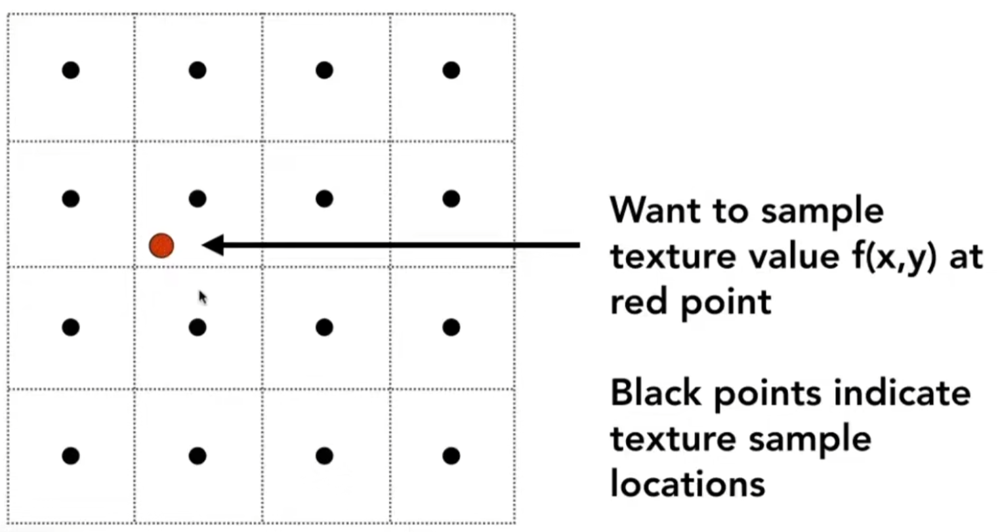
放大后进行映射会出现需要获取贴图上**非整数坐标**的情况，会出现锯齿、模糊等问题，我们需要使用各种方法进行缓解
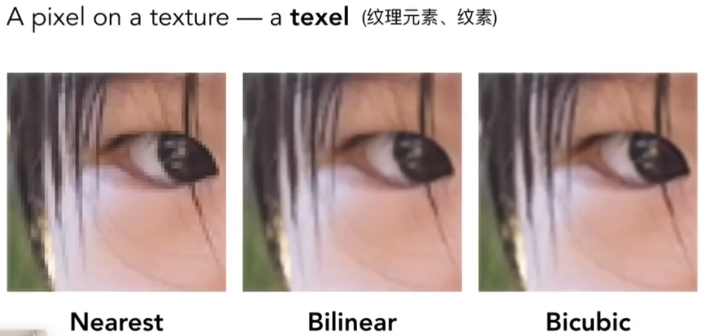
		
直接进行四舍五入找最近的点是上图 Nearest 的效果，效果并不好

### 双线性插值 Bilinear interpolation
思想：找周围四个点的值然后进行加权
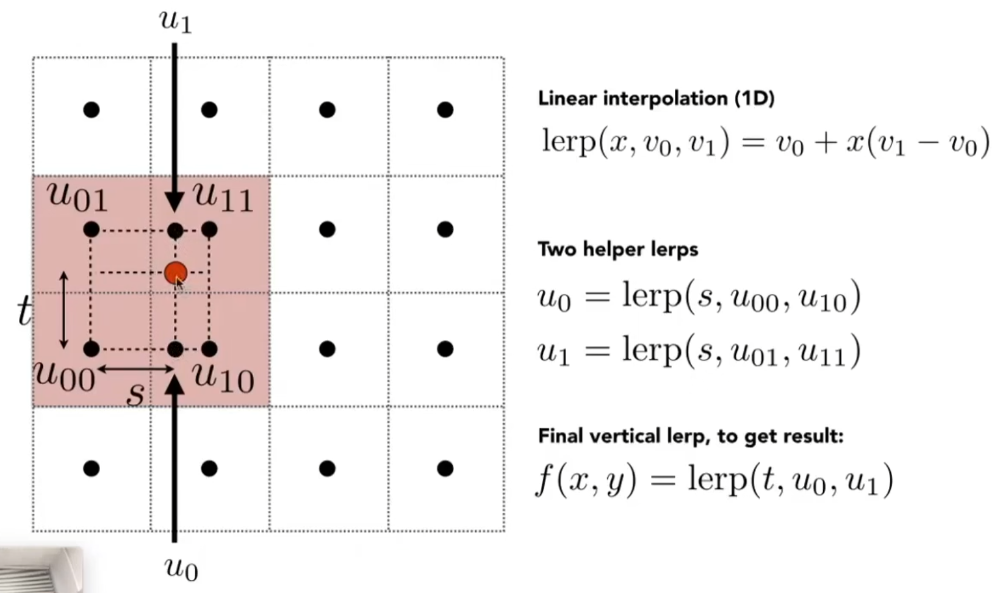

注意这里并没有考虑 uv 范围为 0~1

双线性插值扩展成取周围的 16 个点就是**双三次插值**Bicuic interpolation
## 纹理缩小(Minification)
当一张高分辨率的纹理被应用到一个较小的屏幕区域时
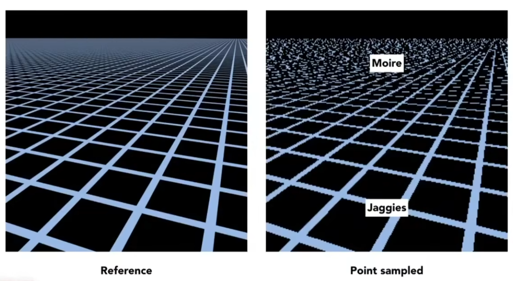

同一个贴图从近到远，由大到小，出现上图这样近处走样远处摩尔纹的情况（已经使用了插值处理）
这个问题的原因是因为远近处的一个像素实际上包含的对应贴图的信息量是不均匀的，直接简单的用中心点去采样会出问题
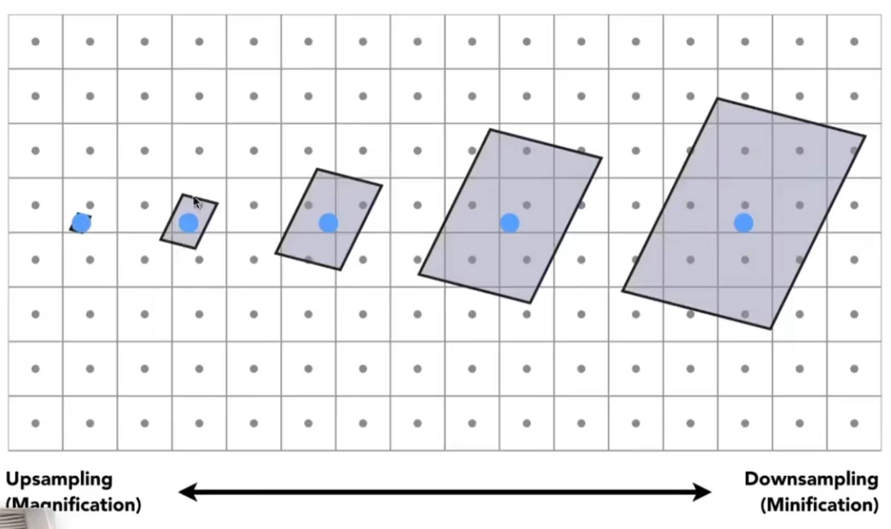
首先效果最好的方法当然是超采样，但是代价太大
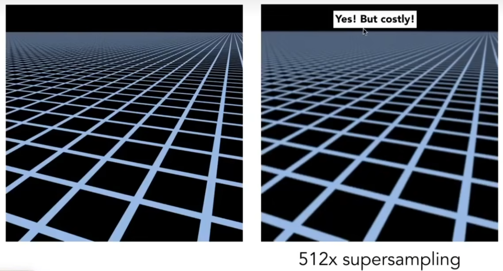
需要更简单直接的方法，直觉是是求平均，但是求平均就需要确定求平均的范围，引出范围查询的问题

### Mipmap
允许我们进行快速、近似、正方形的范围查询（注意只能方形）
思想是用一张图生成一系列图（预处理），用空间换时间
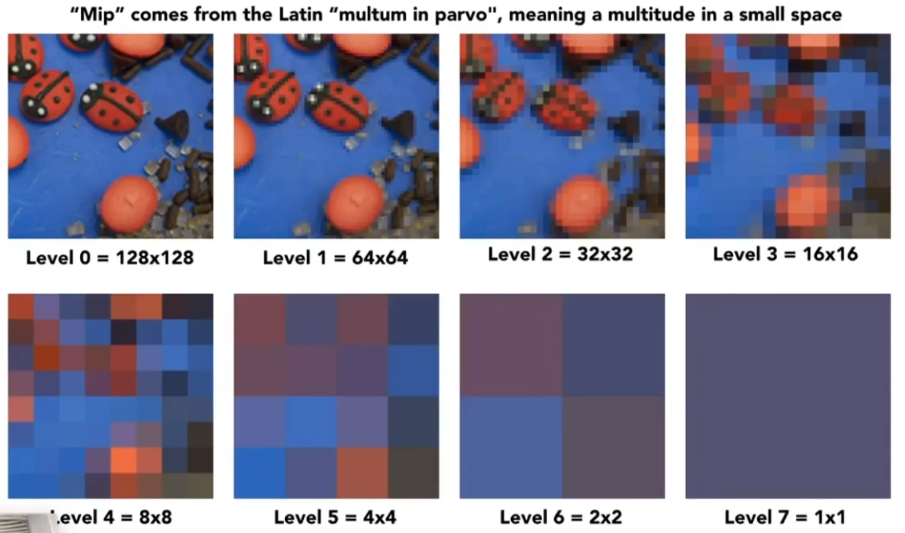
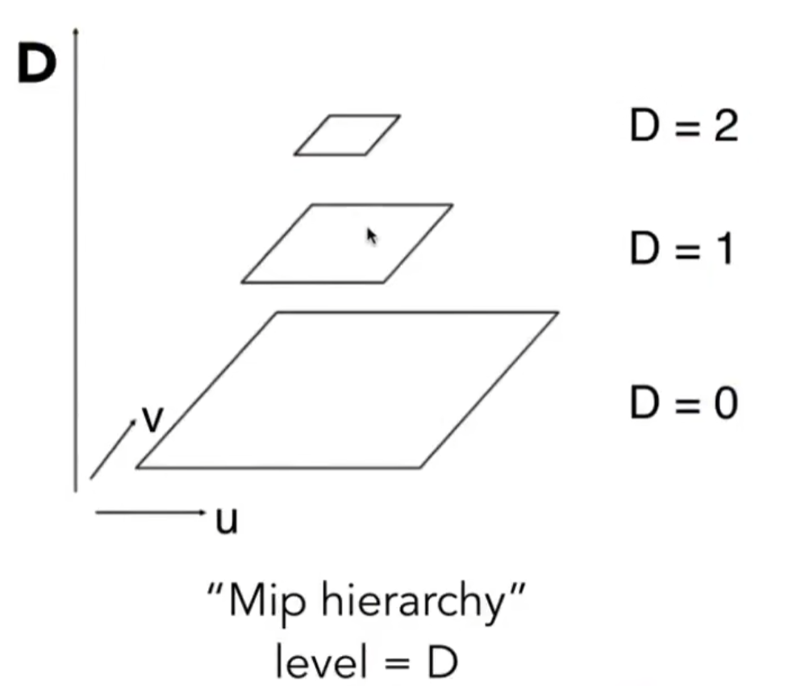

预处理阶段：
- 在渲染之前对原始纹理图像（第0层）进行缩小操作，生成多层次的纹理
 - 每一层的生成：第n层的纹理大小是第n-1层的1/4（即长宽各减半）
- 这种缩放方式使得每一层的纹理都保留与原始纹理相似的结构和特征。
在计算机视觉领域这个被称为“图像金字塔”
分析得出这增加了1/3的空间（等比数列求和）

渲染阶段:我们需要根据纹理在屏幕上的投影面积或距离，选择合适的纹理层级

- 足迹：屏幕像素在纹理空间种覆盖的区域
足迹大小决定了选择哪个分辨率的纹理图像进行渲染

具体步骤：
根据屏幕像素相邻的四个采样点**在纹理空间中的坐标**，计算屏幕像素在纹理空间中的宽度和高度变换率 $(\frac{du}{dx}, \frac{dv}{dx}, \frac{du}{dy}, \frac{dv}{dy})$，据此计算出像素边长在纹理内**对应的长度 L**
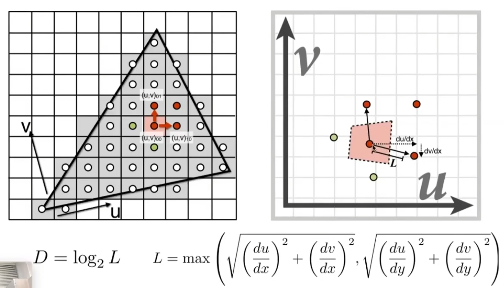
这样就可以以 L 为变成在纹理上用一个正方形近似的代表足迹
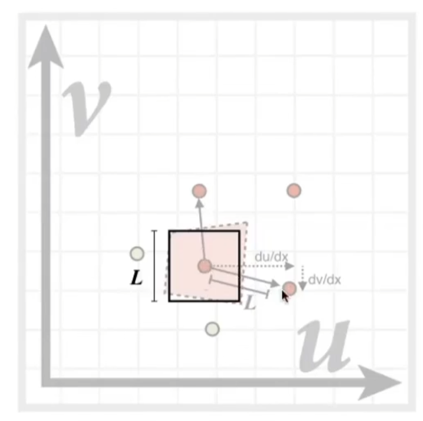 我们所要寻找的最适合的层级就是这个边长为 L 的正方形被缩放为一个像素的层级，即为 $\log_{2}L$ 层 

#### 三线性插值
以上方法得出的 D往往会是小数，在应用中会出现离散导致的断层现象，则需要对其在上下两层（\[D\]、\[D\]+1）的结果进行线性插值，权重为1-D+\[D\]与D-\[D\]（距离大的权重小）

#### 各向异性过滤
Mipmap 后的结果为下图
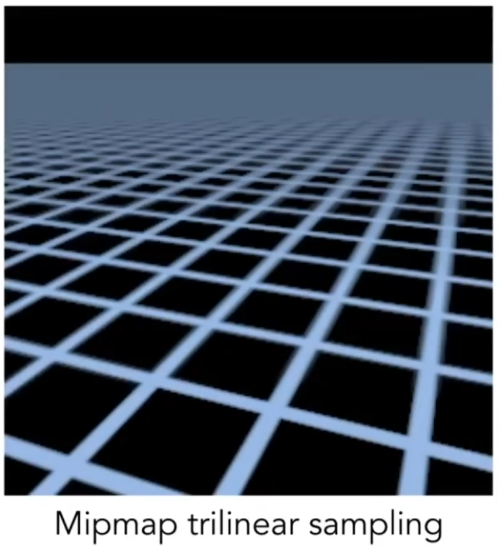
可以发现在远处的结果仍然是糊的，这是由于 Mipmap 只能对方块进行处理导致对细长足迹的处理的误差过大，即 Mipmap 对于不规则足迹的处理效果并不好

**Mipmap 的局限**: Mipmap 的核心假设是像素足迹是**正方形**的 。但当视线与表面夹角很小时（例如，观察延伸到远处的地面），足迹实际上是一个又长又窄的**矩形或梯形**。此时 Mipmap 会选择一个过大的正方形来近似，导致远处的纹理**过度模糊**

下面的方法仅介绍思路，不具体探究实现步骤
##### Ripmaps
是对mipmap的改进，将每层改为长宽各自减半，这样可以对任意长方形或者平行四边形进行处理，但代价变为储存开销变为 2 倍
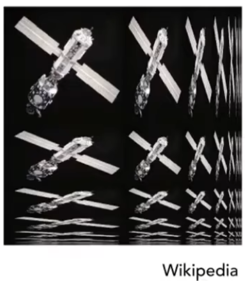

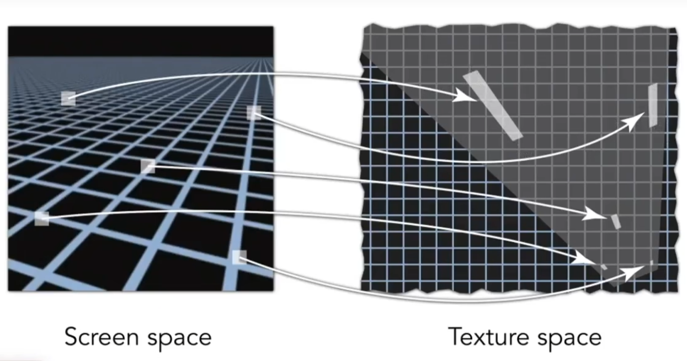
但对于斜着的形状仍然无法很好的解决，需要其他方法

##### EWA椭圆加权平均过滤
足迹映射：将屏幕空间的像素映射到纹理空间，得到一个代表像素在纹理空间覆盖区域的椭圆。
椭圆加权平均：对椭圆区域内的纹素按照距离中心点的权重进行加权平均，得到采样结果（权重一般使用高斯权重函数）