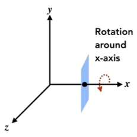
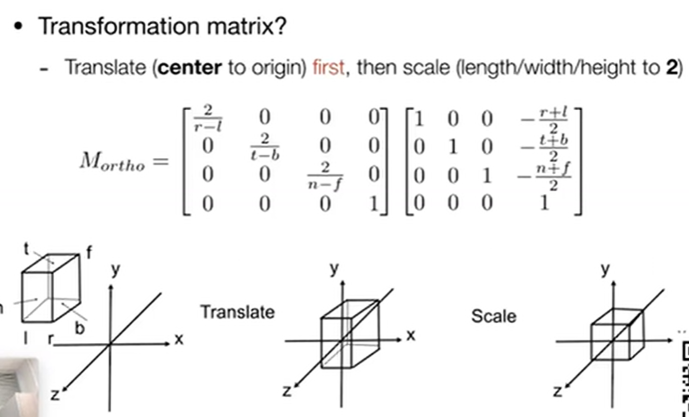
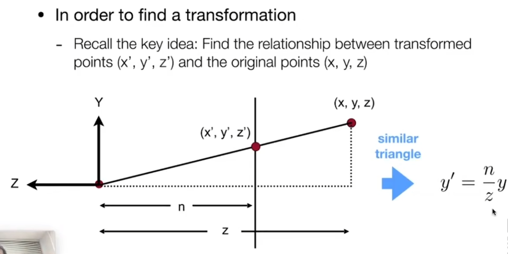
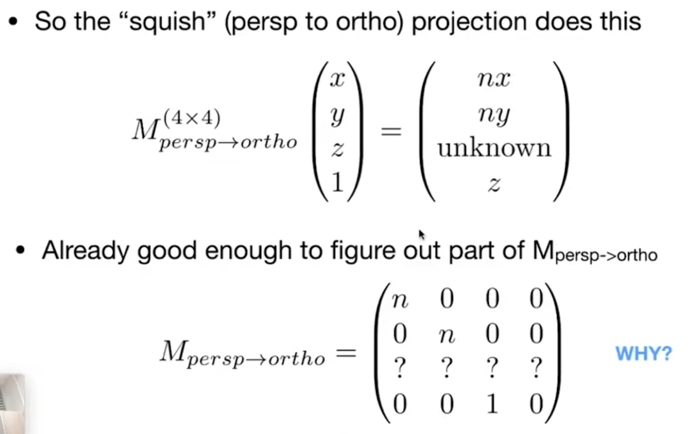
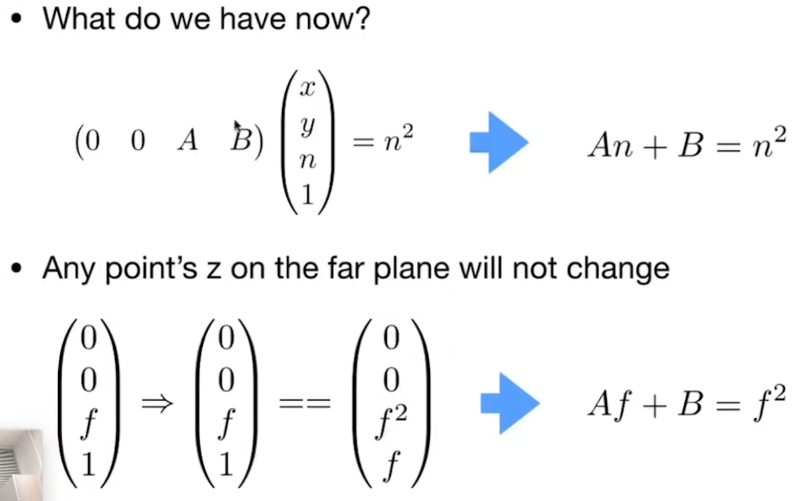
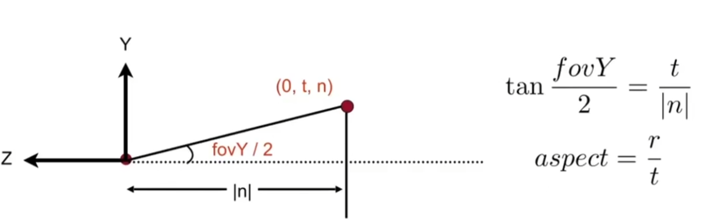

右手坐标系示意图

这是平面上加上一个表示深度的轴，所以 z 轴指向自己（左手远离自己）

# 三维旋转矩阵
三维上绕任意轴的旋转都可以将旋转轴变换到 x、y、z 轴的任一上，然后将旋转变为以（变换后）x、y、z 轴为旋转轴的旋转，然后再变换回去
这意味着所有旋转都可以分解成绕 x、y、z 轴的旋转
$$
\begin{align}
R_{x}(\theta)&=\left[\begin{matrix}1&0&0&0 \\0&\cos \theta &-\sin \theta&0 \\0&\sin \theta &\cos \theta&0 \\0&0&0&1\end{matrix}\right]\text{(空了x行x列)}\\
R_{y}(\theta)&=\left[\begin{matrix}\cos \theta&0&\sin \theta&0 \\0&1&0&0 \\-\sin \theta &0&\cos \theta&0 \\0&0&0&1\end{matrix}\right]\text{(空了y行y列)}\\
R_{z}(\theta)&=\left[\begin{matrix}\cos \theta &-\sin \theta&0&0 \\\sin \theta &\cos \theta&0&0 \\
0&0&1&0 \\0&0&0&1\end{matrix}\right]\text{(空了z行z列)}
\end{align}
$$

思考：为什么绕 y 轴的分布不同
理解：
 $R_{z}(\theta)$ 可以看成是 xy 平面绕 z 轴决定的 (右手定则指定了 x 正方向指向 y 正方向的旋转为正角度),，即 $\vec{z}=\vec{x}\vec{y}$
同样根据右手定则有
- $\vec{x}=\vec{y}\vec{z}$
- $\vec{y}=\vec{z}\vec{x}$

注意到 y 的情况**不符合 xyz 的顺序**会有特殊
附上图方便理解：

# 罗德里格斯公式
- **参考资料1**: [罗德里格斯（Rodrigues）公式推导](https://blog.csdn.net/sinat_31425585/article/details/133204338 "来源：CSDN博客") 
- **参考资料2**: [罗德里格斯旋转公式的几何解释](https://www.cnblogs.com/wtyuan/p/12324495.html "来源：博客园 - WTYuan") 
- **参考资料3**: [百度百科定义](https://baike.baidu.com/item/%E7%BD%97%E5%BE%B7%E9%87%8C%E6%A0%BC%E6%97%8B%E8%BD%AC%E5%85%AC%E5%BC%8F/18878562?fr=ge_ala "来源：百度百科")

向量 $\vec{v}$ 绕旋转轴 $\vec{l}$ 旋转 $\alpha$ 角
$$
\begin{align}
&R(\vec{l},\alpha)=\cos(\alpha)\vec{I}+(1-\cos(\alpha))\vec{l}\ \ \vec{l}^{\ T}+\sin(\alpha)\left[\begin{matrix}0&-\vec{l}_{z}&\vec{l}_{y} \\ \vec{l}_{z}&0&-\vec{l}_{x} \\-\vec{l}_{y}&\vec{l}_{z}&0
\end{matrix}\right] \\
&\vec{V}_{rot}=R\vec{V}
\end{align}
$$
注：$\left[\begin{matrix}0&-\vec{l}_{z}&\vec{l}_{y} \\ \vec{l}_{z}&0&-\vec{l}_{x} \\-\vec{l}_{y}&\vec{l}_{z}&0\end{matrix}\right]$ 为 $\vec{n}$ 的反对称矩阵，$\vec{l}_{x}$ 、$\vec{l}_{y}$ 、$\vec{l}_{z}$ 
分别为对应的 x、y、z 的坐标

证明：

核心思想是将待旋转向量分解为平行于旋转轴和垂直于旋转轴的两个分量。平行分量在旋转过程中保持不变，而垂直分量则在与旋转轴垂直的平面上进行旋转

罗德里格斯公式不被左右手系限制，这是因为对于一个**给定的正角度** $\alpha$，旋转的“方向”（顺时针或逆时针）是与坐标系的**左右手性**相关的

# 视图变换
Q: 为什么进行视图变换
A：摄像机运动和物体运动导致的视图变化都是由于**相对运动**导致的，故可以统一为**固定摄像机**而物体发生运动，即用视图变换来统一两种运动

## 摄像机基础设置
- 摄像机所在点的位置（视点/目点）：$e$（在标准基中的位置）
- 看的朝向向量（中视线）：$\vec{g}$（单位向量）
- 上方朝向向量：$\vec{t}$（单位向量）

我们规定将摄像机固定在原点而中视线方向朝向 **z 轴的负方向**，向上指向 **y 轴正方向**（这样子确定的是摄像机确定新坐标系）

## 视图变化矩阵
- **参考资料**: [视图变换](https://zhuanlan.zhihu.com/p/448547679 "来源：知乎") 

$$
\begin{align}
T_{view}&=\left[\begin{matrix}
1&0&0&-x_{e} \\
0&1&0&-y_{e} \\
0&0&1&-z_{e} \\
0&0&0&1
\end{matrix}\right] \\
R_{view}&=\left[\begin{matrix}
x_{\vec{g}\times \vec{t}}&y_{\vec{g}\times \vec{t}}&z_{\vec{g}\times \vec{t}}&0 \\
x_{\vec{t}}&y_{\vec{t}}&z_{\vec{t}}&0 \\
x_{-\vec{g}}&y_{-\vec{g}}&z_{-\vec{g}}&0 \\
0&0&0&1
\end{matrix}\right]\text{,注：}x_{\vec{g}\times \vec{t}}\text{表示}\vec{g}\times \vec{t}的值
\end{align}
$$
作用是将标准坐标系下的坐标变换到相对于相机所确定的坐标系下的坐标：$P_{\text{摄像}}=R_{view}T_{view}P_{\text{标准}}$
推导过程：
- 先平移到原点，平移矩阵 $T_{view}$ 易得，解方程 $P_{\text{原点}}=T_{view}P_{\text{标准}}$
- 然后整体旋转，$\vec{g}\to-\vec{Z},t\to \vec{Y},(\vec{g}\times \vec{t})\to \vec{X}$，旋转矩阵 $R_{view}$ 不好求，反过来思考：标准系转到坐标系的矩阵 $R_{view}^{-1}=R_{view}^T$
	- 从基变换的角度易得 $R_{view}^{-1}=\left[\begin{matrix}x_{\vec{g}\times \vec{t}}&x_{\vec{t}}&x_{-\vec{g}}&0\\y_{\vec{g}\times \vec{t}}&y_{\vec{t}}&y_{-\vec{g}}&0\\z_{\vec{g}\times \vec{t}}&z_{\vec{t}}&z_{-\vec{g}}&0\\0&0&0&1\end{matrix}\right]$，提示 $\left[\begin{matrix}x_{\vec{g}\times \vec{t}}\\y_{\vec{g}\times \vec{t}}\\z_{\vec{g}\times \vec{t}}\\0\end{matrix}\right]=\vec{g}\times \vec{t}$，是 $\vec{X}$ 对应的基

# 两种投影方式
我们需要将在摄像机所确定的坐标系下的三维物体投影到二维上变成一张图
- 正交投影：平行线不相交
- 透视投影：平行线相交于某点，近大远小
## 正交投影变化
**参考资料**: [正交投影变换](https://zhuanlan.zhihu.com/p/473031788"来源：知乎") 
【1】初始的长方体被称为盒式可视空间，为了节省计算资源，只有可视空间内的物体才需要进行绘制
【2】为什么不简单的使用丢掉 z 坐标的方法：
	[1]**规范化坐标系**：现实情况几乎所有的图形系统都把坐标系的空间范围限定在 (-1,1) 范围内，这么做是为了**方便移植**，使坐标系独立于各种尺寸的图形设备
	[2]z 坐标需要保留：想象一下可视空间内存在多个物体的场景，前面的物体可能遮挡后面的物体导致无法被看见，绘制图像时需要**利用 z 坐标来判断前后遮挡关系**来觉得那个物体需要绘制，因此保留 z 坐标是最终图形呈现所必须的参数

初始长方体（盒式可视空间）由 $[l, r]×[b, t]×[f, n]$ 确定，最终需要变换到 $[−1,1]^3$ 范围内

注意：图中初始长方体要求**与坐标系对齐**（在本节课中暂时不考虑旋转的问题）

推导过程：
- 【1】先进行平移变换，将盒式可视空间的**中心点，移动到坐标原点**（右边的矩阵）
- 【2】在进行拉伸变换，将长方体空间拉伸成正方体（左边的矩阵）

## 透视投影变换

注意：透视变换的可视空间在这里同正交变换一样被要求为了要于坐标系对齐，而且棱台对应的交点在原点

透视投影变换的可视空间（如左图）是棱台形的，将他挤压为长方体可以**将平行线转化为相交线**，这样做可以实现透视。

透视投影变换的可视空间由前后两个平面确定，其**规定了z的范围**，前为n后为 f(并不是x、y没用，只是求转换矩阵用不到）
并且规定：挤压前后，前后平面上的点的 **z 值并不会变**，这个在下面有大用
$$
M_{persp\to ortho}=\left[\begin{matrix}
n&0&0&0 \\
0&n&0&0 \\
0&0&n+f&-fn \\
0&0&1&0
\end{matrix}\right]
$$
推导过程：

注意这里的 n，z 同为负号

**挤压后同一棱线上的点的 x、y 应该相等**，故 $y'=\frac{n}{z}y,x'=\frac{n}{z}x$ ，则在齐次坐标下，一个点 $(x,y,z,1)$ 会被变换到 $(x,y,z,z/n)$。为了让 w 分量变回1，我们乘以 z，得到 $(nx, ny, z^2, z)$。但这里的 $z^2$ 并非普遍的现象（只是对于棱线上的是如此），所以我们所以写成 unknown 来表示我们目前仍然不知道关于 z 变换的普遍规律
则可以部分推导得到下矩阵（注意转化后的坐标是齐次坐标）

由于挤压的原因（可以理解为挤压导致密度增大，但还是要**保证内部点的均匀分布**），z 轴的变化不会像 x、y 轴变化这么理所当然，我们根据规定找到**不会动的点**（前平面的顶点和后平面的原点）的坐标变化来寻找 z 轴的变化规律：

我们将矩阵的第三行设为 `(0, 0, A, B)`，因为 $z'$ 的变换与 $x$ 和 $y$ 无关

对于近平面上的点 $(z=n)$，我们要求 $z'=n$，即 $(An+B)/n = n \Rightarrow An+B = n^2$。同理对于远平面可得另一个方程。

对于变换后的矩阵我们再次进行正交投影变换，就可以得到符合透视原理的目的坐标了：
$$
M_{persp}=M_{ortho}M_{persp\to ortho}
$$

透视投影转换为正交投影后的 l、r、b、t 如何确定：
- vertical Field of View (fov Y) 垂直可视角度（垂直可与水平相互转换）
- Aspect ratio=width/height 宽高比

由于是垂直可视角度，就可以得到 t 的值，由于对称性，则 b=-t
再根据宽高比得到 r 的值, 由于对称性，则 l=-r

